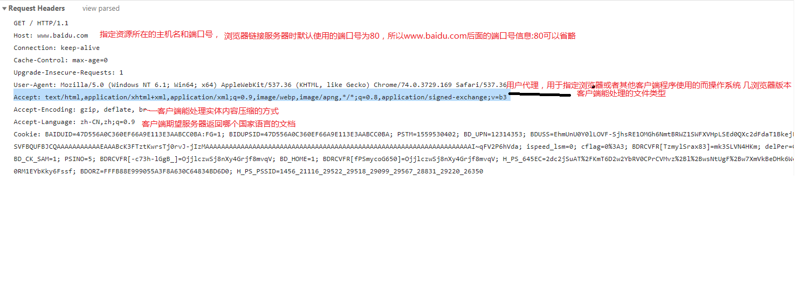
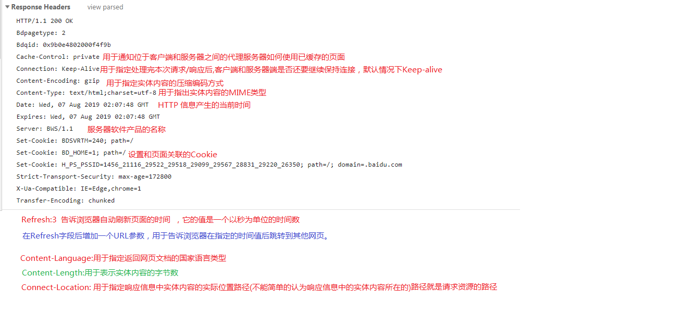
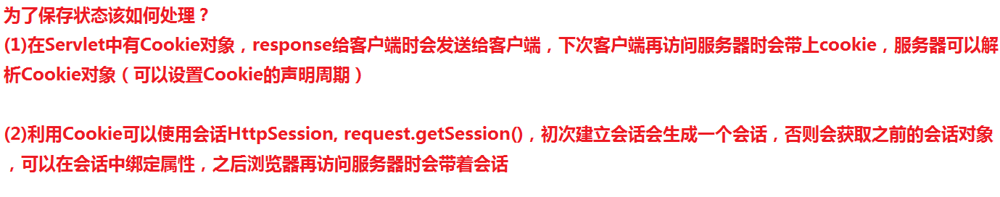
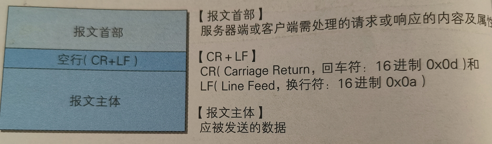
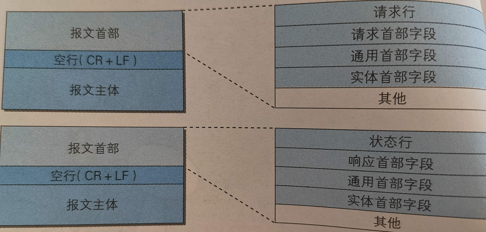
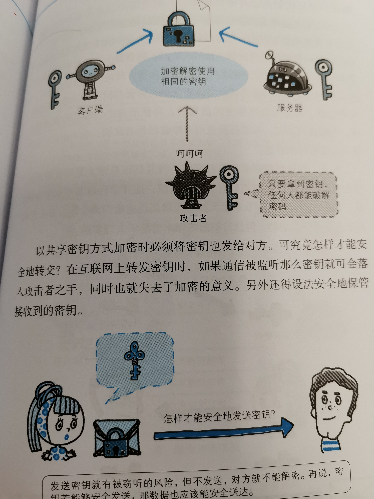
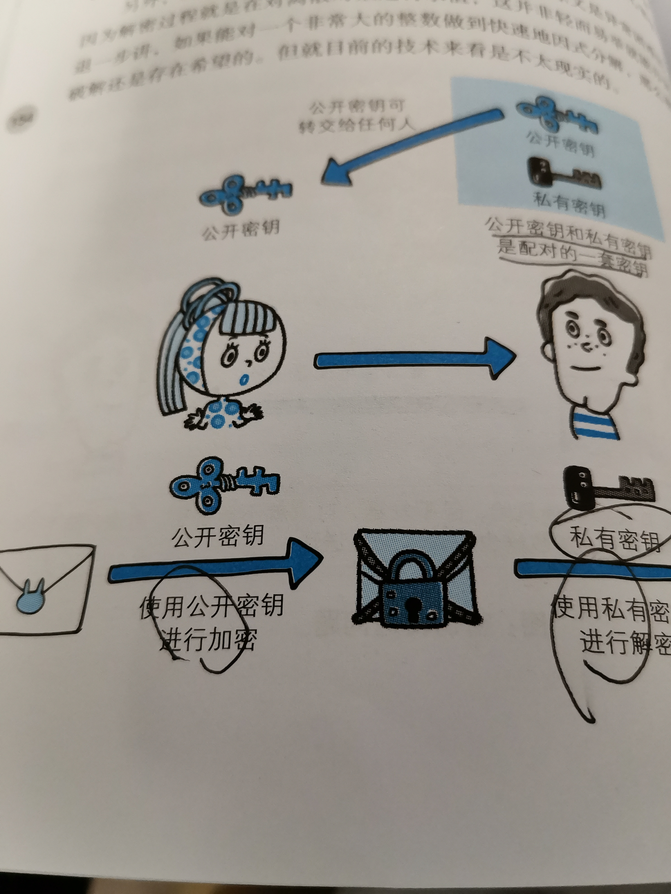
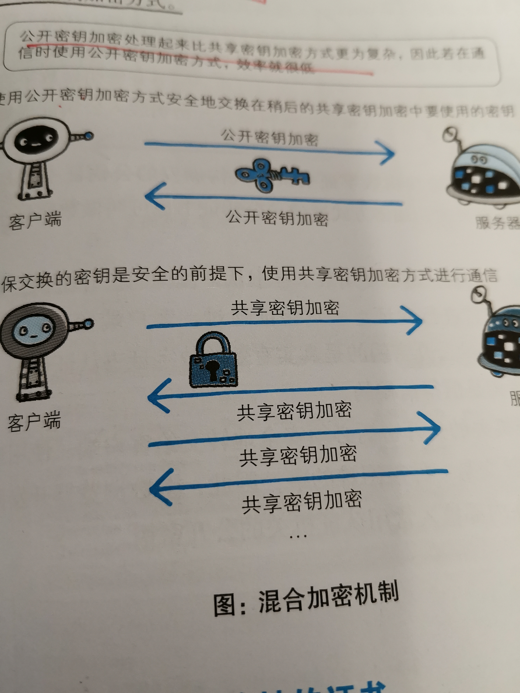
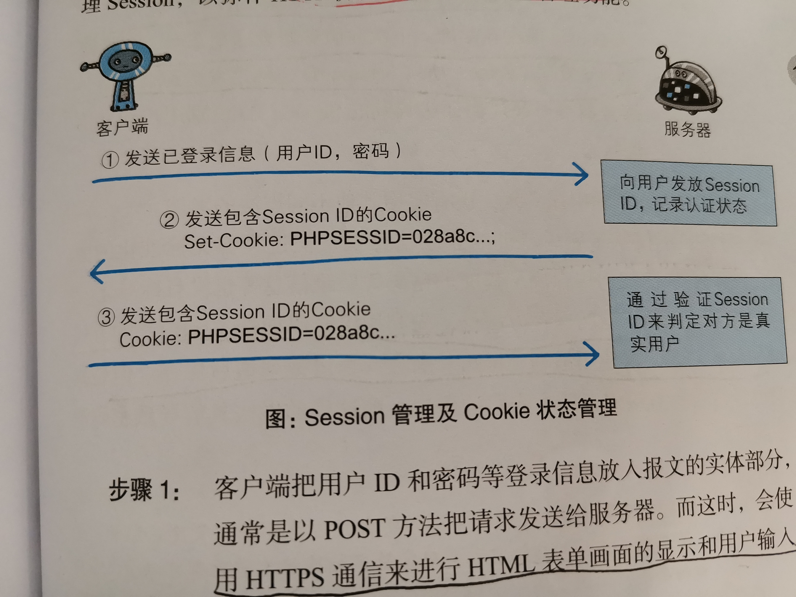

**2019/8/9 - 2019/8/12阅读《图解HTTP》笔记整理** 

## 1、了解Web网络基础
### 1.1、使用HTTP协议访问W	eb
**客户端:**通过发送请求获取服务器资源（例如：web浏览器) 
> web使用一种名为HTTP(HypterText Transfer Protocol,超文本传输协议)的协议作为规范，完成从客户端到服务器端等一系列运作流程。
### 1.2 网络基础TCP/IP
为了理解HTTP有必要事先了解一下TCP/IP协议族。 
 *通常使用的网络(包括互联网)是在TCP/IP协议族的基础上运作的。而HTTP属于它内部的一个子集。*
> 计算机与网络设备要通信，双方就必须基于相同的方法。比如，如何探测到通信目标、由哪一边先发起通信、使用哪种语言进行通信、怎样结束通信等规则都需事先确定。不同硬件、操作系统之间的通信，所有一切都需要一种规则。而我们把这种规则称为协议。

---
> 协议中存在各式各样的内容，从电缆的规格到IP地址的选定方法、寻找异地用户的方法、双方建立通信的顺序，以及Web页面显示需要处理的步骤等等。像这样把与互联网相关联的协议集合起来总称为TCP/IP.

#### 1.2.1、 TCP/IP的分层管理
TCP协议族里最重要的一点就是分层。**TCP/IP协议族按层次分别分为以下四层：** 
 **应用层，传输层，网络层和数据链路层。** 

层次|作用
-|-|
应用层|**决定了向用户提供应用服务时通信的活动，如FTP文件传输协议)和DNS。**|
传输层|**对上层应用层，提供处于网络连接中国的两台计算机之间的数据传输，如 TCP和UDP.**|
网络层|**c处理在网络上流动的数据包，数据包是网络传输的最小数据单位，该层规定了通过怎样的路径到达对方计算机，**|
链路层|**用来处理连接网络的硬件部分。**|
---
##2、简单的HTTP协议
###2.1、HTTP协议用于客户端与服务器端之间的通信

*请求访问文本或图像等资源的一端称为客户端，而提供资源响应的一端称为服务器端。* 

**应用HTTP协议时，必定是一端担任客户端角色，另一端担任服务器端角色。**
### 2.2、 通过请求和响应的交换达成通信

HTTP协议规定，请求从客户端发出，最后从服务器端响应该请求并返回。换句话说，肯定是从客户daunt开始建立通信的，服务器端在没有接受到请求之前不会发送响应。
>请求报文：**由请求方法，请求URI,协议版本，可选的请求首部字段和实体内容构成.** 
>响应报文：**由协议版本，状态码,用以解释状态码的原因短语，可选的响应首部字段和实体内容构成.** 
**例子：请求和响应信息**

--------
-------
###2.3 HTTP是不保存状态的协议
**HTTP是一种不保存状态，即无状态（stateless)协议。HTTP协议自身不对请求和响应之间的通信状态进行保存。也就是说在Http这个级别，协议对于发送过的请求或响应都不做持久化处理。** 
**HTTP/1.1虽然是无状态协议，但为了实现期望的保持状态功能，于是引入了Cookie技术，有了Cookie再用HTTP协议通信，就可以管理状态。** 

### 2.4 告知服务器意图的HTTP方法
* GET
* post
* PUT
* HEAD
* OPTIONS
* TRACE
* DELETE
* CONNECT

请求方法|作用
-|-|
GET(获取资源)|**用来获取请求访问已被URI识别的资源，指定的资源经服务器端解析返回响应内容。默认**|
POST(传输实体主体)|**用来传输实体的主体，与GET方法类似，但一般不用GET方法，不容易造成信息泄露**|
PUT(传输文件)|**就像FTP协议的文件上传一样，要求在报文的主体内容中包含文件内容，然后保存到请求的URI指定的位置。（存在安全问题，不常用）**|
HEAD(获得报文首部)|**和GET方法一样，只是不返回报文主体部分，用于确认URI的有效性及资源更新的日期时间。**|
DELETE(删除文件)|**用来删除文件，是与PUT相反的方法，DELETE方法按请求URI删除指定的资源（一般也不实用）**|
OPTIONS(询问支持的方法)|**查询针对请求URI指定的资源支持的方法。**|
TRACE(追踪路径)|**让WEB服务器端将之前的请求通信返回给客户端的方法。**|

**get与POST的区别：**

* **GET提交的数据会放在URL之后。POST放在Body中。**
* **GET提交的数据大小是有限制的（URL长度有限制）。POST没有限制。**
* **GET方式提交数据会带来安全问题，比如用户名和密码出现在URL中。页面被缓存或其他人访问这台机器，可从历史记录中获得该用户的账号和密码。**

### 2.5、持久链接节省通信量
HTTP/1.1 和一部分的 HTTP/1.0 想出了持久链接的方法，持久链接的特点是，只要任意一段没有提出断开链接，则保持TCP链接状态。
 
>持久链接的好处在于减少了TCP链接的重复建立和断开锁造成的额外开销，减轻了服务器端的负载

### 2.6、使用Cookie的状态管理
*问题：HTTP是无状态协议，它不对之前发生过的请求和响应的状态进行管理，也就是谁，无法根据之前的状态进行本次的请求处理？*
>解决方案：引入Cookie技术，Cookie技术通过在请求和响应报文中写入Cookie信息来控制客户端的状态。 

Cookie会根据从服务器端发送的响应报文内的一个叫做Set-Cookie的首部字段信息，同指客户端保存Cookie.当下次客户端再次往服务器发送请求时，客户端会自动在请求报文中加入Cookie值后发送出去。 
服务器端发现客户端发送过来的Cookie后，会检查究竟是从哪一个客户端发来的链接请求，然后对比服务器上的记录，最后得到之前的状态信息。
------

##3、 HTTP报文内的HTTP信息
>HTTP通信过程包括从客户端发往服务器端的请求及从服务器端返回给客户端的响应，

### 3.1HTTP报文
**用于HTTP协议交互的信息被称为HTTP报文。请求端（客户端）的HTTP报文叫做请求报文，响应端（服务器端）的叫做响应报文。** 
**HTTP报文本身是由多行（CRLF做换行符)数据构成的字符串文本。** 
**HTTP报文大致可分为报文首部和报文主体两块。二者由最初出现的空行（CR+LF)来划分，通常不一定有报文主体** 

### 3.2 请求报文及响应报文的结构

* 请求行：包含请求的方法，请求的URI和HTTP版本
* 状态行： 包含表名状态响应结果的状态码，原因短语和HTTP版本。
* 首部字段： 包含表示请求和响应的各种条件和属性的各类首部。
* 其他

## 4、返回结果的HTTP状态码
> HTTP状态码负责表示客户端HTTP请求的返回结果、标记服务器端的处理是否正常、通知出现的错误等工作。

**状态码的职责是当客户端向服务器端发送请求时，描述返回的请求结果，借助状态码，用户可以知道服务器端是正常处理了请求，还是出现了错误。** 

|类别|原因短语
-|-|-|
1xx|**信息性状态码**|接收的请求正在处理    |
2xx|**成功状态码.**|请求正常处理完毕|
3xx|**重定向状态码**|需要进行附加操作以完成请求      |
4xx|**客户端错误状态码**| 服务器无法处理请求        |
5xx|**服务器错误状态码**|服务器处理出错请求         |

**常用的一些状态码：**

* 200 ok: 表示客户端发来的请求在服务器端被正常处理了。
* 302 Found: 临时重定向，该状态表示请求的资源已被分配了新的URI
* 400 Bad Request: 该状态码表示请求报文中存在语法错误，当错误发生时，需修改请求的内容后再次发送请求。
* 401 Unauthorized: 发送的请求需要通过HTTP认证的认证信息
* 404 Not Found: 服务器上没有请求的资源
* 500 Internal Server Error:服务器端在执行请求时发生了错误

## 5、与HTTP协作的Web服务器
>一台Web服务器可搭建多个独立域名的Web网站，也可作为通信 路径上的中转服务器提升传输效率。

## 6、HTTP首部
### 6.1、HTTP首部字段传递重要信息
HTTP首部字段是构成HTTP报文的要素之一。在客户端与服务器端之间以HTTP协议进行通信的过程中，无论是请求还是响应都会使用首部字段，他能起到传递额外重要信息的作用。
### 6.2 4种HTTP首部字段类型
1、通用首部字段： 请求报文和响应报文都会使用的首部 
2、请求首部字段 
3、响应首部字段 
4、实体首部字段 

**通用首部字段表** 

首部字段名称|说明
-|-|
Date|**创建报文的日期**
Connection|**链接的管理**
Cache|**控住缓存的行为**

**请求首部字段表** 

首部字段名称|说明
-|-|
HOST|**请求资源所在服务器的名称**
ACCEPT|**用户代理可处理的媒体类型**
ACCEPT-CHArset|**优先的字符集**
ACCEPT-Language|**优先的语言（自然语言)**
IF-MATCH|**比较实体标记**
IF-Modified-Since|**比较资源更新的时间**
Range|实体的字节范围请求
User-Agent|创建请求的浏览器和用户代理名称等信息传达给服务器

**响应首部字段表** 

首部字段名称|说明
-|-|
Server|**HTTP服务器的安装信息**
LOcation|**零客户端重定向指定URI**
*几乎所有浏览器在接收到包含首部字段Location的响应后，都会强制性的尝试对已提示的重定向资源的访问。*

**实体首部字段表** 

首部字段名称|说明
-|-|
ALLOW|**资源可支持的HTTP方法**
Content-Language|**实体主体的自然语言**
Content-Length|**实体主体的大小(字节)**
Content-Type|**实体主体的媒体类型**

**Cookie相关首部字段表** 

首部字段名称|说明
-|-|
Set-Cookie|**开始状态管理的Cookie信息**
Cookie|**服务器接收到的Cookie信息**
----

## 7、 确保Web安全的HTTPS
在HTTP协议中有可能存在信息窃听或身份伪装等安全问题。使用**HTTPS**通信机制可以有效地防止这些问题。
### 7.1 HTTP的缺点
HTTP主要有这些不足，举例如下： 

*  通信使用明文，内容可能会被窃听
* 不验证通信双方的身份，因此可能遭遇伪装
*  无法证明报文的完整性，所以有可能已遭篡改

#### 7.1.1 通信使用明文可能会被窃听
由于HTTP本身不具备加密功能，所以也无法做到对通信整体（使用HTTP协议通信的请求和响应的内容）进行加密。即HTTP报文使用明文（指未经过加密的报文）方式发送。 
**加密处理防止被窃听,在目前大家正在研究的如何防止窃听保护信息的几种对策中，最为普及的就是加密技术,加密的对象可以有这么几个：** 

*  **通信的加密** 
*HTTP协议中没有加密机制，但可以通过和SSL(Secure Socket Layer)或TSL(Transport Layer Security)的组合使用，加密HTTP的通信内容。用SSL建立安全通信线路之后，就可以在这条线路上进行HTTP通信了。与SSL组合使用的HTTP被称为HTTPS。*

*  **内容0的加密** 
*对HTTP协议传输的内容本身加密，即吧HTTP报文里所含的内容进行加密处理，这种情况下，客户端需要对HTTP报文进行加密处理后再发送请求。为做到有效地内容加密，前提是要求客户daunt和服务器端同时具备加密和解密机制*
#### 7.1.2 不验证通信放的身份可能遭遇伪装
*HTTP协议中的请求和响应不会对通信方进行确认。也就是说存在“服务器就是发送请求中URI真正指定的主机”，返回的响应是否真的返回到实际提出请求的客户端等类似问题*。 
HTTP协议的实现本身简单，无论是谁发送过来的请求都会返回响应，因此不能确认通信方，会存在以下各种隐患： 

* 无法确认请求发送至目标的Web服务器是否是按真实意图返回响应的那台服务器，有可能是已伪装的Web服务器。
* 无法确定响应返回到的客户端是否是按照真实意图接收响应的那个客户端。有可能是已伪装的客户端。
* 无法确认正在通信的对方是否具备访问权限。因为某些Web服务器上保存着重要的信息，只想发送给特定用户通信的权限。
* 无法判定请求是来自客户，出自谁手 

-------
解决方案: 
**虽然使用HTTP协议无法确定通信方，但如果使用SSL则可以。SSL不仅提供加密处理，而且还使用了一种被称为证书的手段，可用于确定通信方。** 
**证书由值得信任第三方机构颁发，用以证明服务器端和客户端是实际存在额。只要能够确认通信方（服务器或客户端）持有的证书，即可判断通信方的真实意图。通过使用证书，以证明通信方就是意料中的服务器，这对使用者个人来讲，也减少了个人信息泄露的危险性。** 
### 7.1.3 无法证明报文的完整性
*所谓完整性是指信息的准确度。若无法证明其完整性，通常也就意味着无法判断信息是否准确。* 

*  **接收到的信息可能有误** 
*  **接收到的信息可能有误** 

## 7.2 HTTP+加密+认证+完整性保护=HTTPS
**可以看出7.1节中的所替代的HTTP的一些问题，需要在本节中加以解决：** 
### 7.2.1 HTTP加上加密处理和认证以及完整性保护后即是HTTPS
*为统一解决上述的问题，需要在HTTP上再加入加密处理和认证等机制。我们把添加了加密及认证机制的HTTP称为HTTPS(HTTP SECURE). 
*经常会在Web登录页面和购物结算界面等使用HTTPS通信。使用HTTPS通信时，不再用 http://,而是改用https://.另外，当浏览器访问HTTPS通信有效地Web网站时，浏览器的地址栏内会出现一个带锁的标记。对HTTPS的显示方式会因为浏览器的不同而有所改变。* 
### 7.2.2 HTTPS是身披SSL外壳的HTTP
**HTTPS并非是应用层的一种新协议，只是HTTP通信接口部分采用SSL和TLS协议替代而已。** 
**通常，HTTP直接和TCP通信。当使用SSL时，则演变成先和SSL通信，再由SSL和TCP通信。** 
**SSL是独立于HTTP的协议，所以不光是HTTP协议，其他运行在应用层的SMTP和Telent等协议均可配合SSL协议使用，可以说SSL是当今世界上应用最为广泛的网络安全技术。** 
### 7.2.3相互交换秘钥的公开秘钥加密技术
*SSL采用一种叫做公开秘钥的加密处理方式。* 
 **近代的加密方法中的加密算法是公开的，而秘钥确是保密的，通过这种方式得以保持加密方法的安全性** 
 **加密和解密都会用到秘钥。没有秘钥就无法对密码解密，反过来，任何人只要持有秘钥就能解密，如果秘钥被攻击者获得，那加密也就失去了意义** 

* **共享秘钥加密的困境** 
加密和解密同用一个秘钥方式称为共享秘钥加密，也称为对称秘钥加密。
 
**使用两把秘钥的公开秘钥加密**

 
**HTTPS采用混合加密机制**

## 8 确认访问用户身份的认证
HTTP使用的认证方式： 

*  **BASIC认证（基本认证）** 
*  **DiGEST认证** 
*  **SSL客户端认证** 
*  **FORMBase（基于表单认证）** 

**由于使用上的便利性及安全性问题，HTTP协议标准提供的BASIC认证和DIGEST认证几乎不怎么使用，另外SSL客户端认证具有高度的安全等级，但是因为导入及维持费用等问题，还尚未普及。** 
**基于表单认证的标准规范尚未有定论，一般会使用COOKIE来管理会话(Session).** 
 **基于表单认证本身是通过服务器端的Web应用，将客户端发送过来的用户ID和密码与之前登陆过的信息做匹配来进行认证。** 
> 但鉴于HTTP是无状态协议，之前已认证过的用户状态无法通过协议层面保存下来。即，无法实现状态管理，因此即使当用户下一次继续访问，也无法区分与其他用户。于是我们使用Cookie来管理Session,以弥补HTTP协议中不存在的状态管理功能。

**流程**

* 客户端吧用户ID和密码等登陆信息放入报文的实体部分，通常是POST方法吧请求发送给服务器。而这时，会使用HTTPS通信来进行HTML表单画面的显示和用户输入数据的发送。 
* 服务器会发放用以识别用户的Session ID,通过验证从客户端发送过来的登录信息进行身份认证，然后把用户的认证状态与Session ID绑定后记录在服务器端。向客户端返回响应时，会在首部字段Set-Cookie内写入Session ID，可以吧Session ID想象成一种用以区分不同用户的等位号。 
* 客户端收到从服务器端发送过来的Session ID后，会将其作为Cookie保存在本地。下次向服务器发送请求时，浏览器会自动发送Cookie，所以Session ID也随之发送到服务器。服务器端可以通过验证接收到Session ID识别用户和其认证状态。

*另外，不仅基于表单认证的登录信息及认证过程都无法标准化的方法，服务器端应该如何保存用户提交的密码等登录信息也没有标准化。* 

## 9构建Web内容的技术
**在Web刚出现时，我们只能浏览那些页面样式简单的内容。如今，Web使用各种各样的技术**
### 9.1 HTML

* **Web页面几乎全由HTML构建**
* **动态HTML:客户端脚本语言将静态HTML内容变成动态的技术的总称；动态HTML技术是通过调用客户端脚本语言 JavaScript，实现对HTML的web页面的动态改造。利用DOM(文本对象模型)可指定于发生动态变化的HTML元素。**
* * **因Java而普及的Servlet**
* **数据发布的格式及语言** 

&nbsp;&nbsp;&nbsp;&nbsp;&nbsp;&nbsp;&nbsp;&nbsp;     **可扩展语言XML** 
&nbsp;&nbsp;&nbsp;&nbsp;&nbsp;&nbsp;&nbsp;&nbsp;     **JavaScript衍生出的轻量级易用JSON** 