## 1、网络基础知识
### 1.1计算机网络出现的背景
>起初，计算机以单机模式被广泛使用（这种方式也叫独立模式）。然而随着计算机的不断发展，人们已不再局限于单机模式，而是将一个个计算机连接在一起，形成一个计算机网络。连接多台计算机可以实现信息共享，同时还能在两台物理位置较远的机器之间即时传递信息。 

**计算机网络，根据其规模可分为WAN(Wide Area Network,广域网）和LAN(Local Area Network,局域网）**

* 广域网：指覆盖多个远距离区域的远程网络。比广域网再小一级的，链接整个城市的网络叫做城域网。 
* 局域网:指一个楼层，一栋楼或一个校园等相对较小的区域内的网络。  

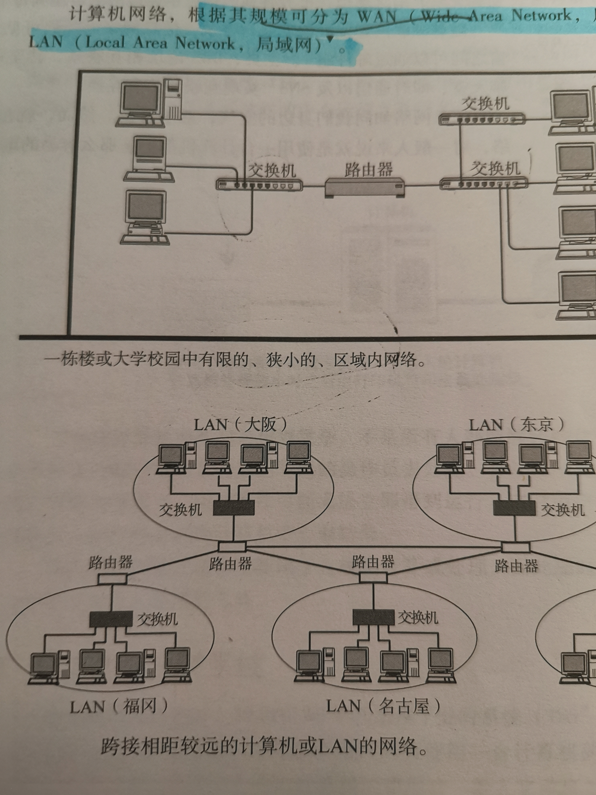

### 1.2 计算机网络发展的7个阶段
#### 1.2.1 批处理
批处理：事先将用户程序和数据装入卡片或磁带，并由计算机按照一定的顺序读取，使用户所要执行的这些程序和数据能够一并批量得到处理的方式。
#### 1.2.2 分时系统
分时系统：指多个终端与同一个计算机连接，允许多个用户同时使用一台计算机的系统。 
*分时系统的重要特性包括多路性、独占性、交互性和及时性。*

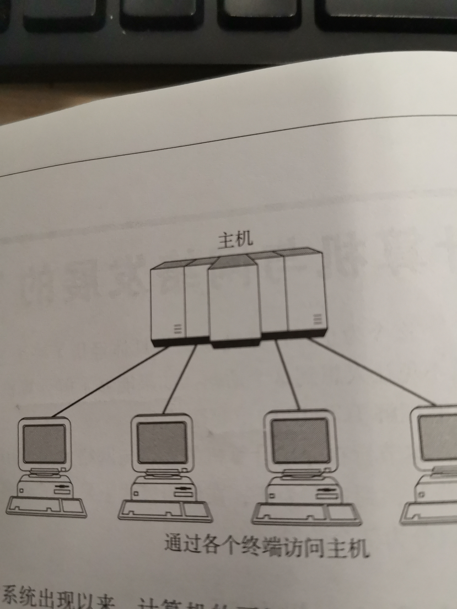

#### 1.2.3 计算机之间的通信
#### 1.2.4计算机网络的产生

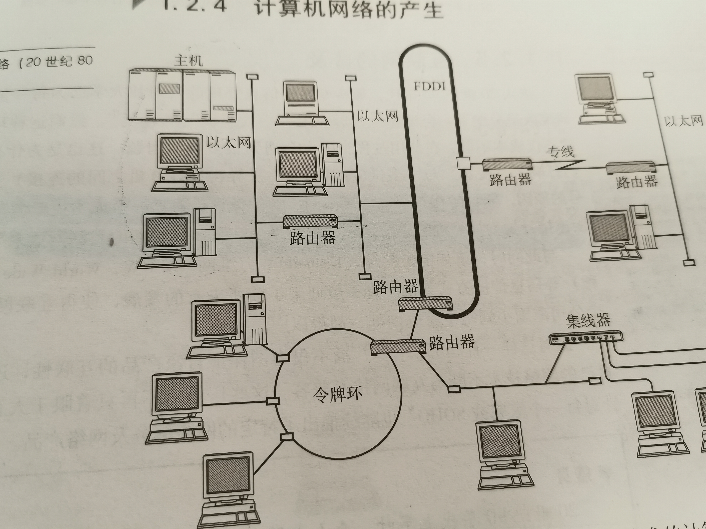

#### 1.2.5互联网的普及 

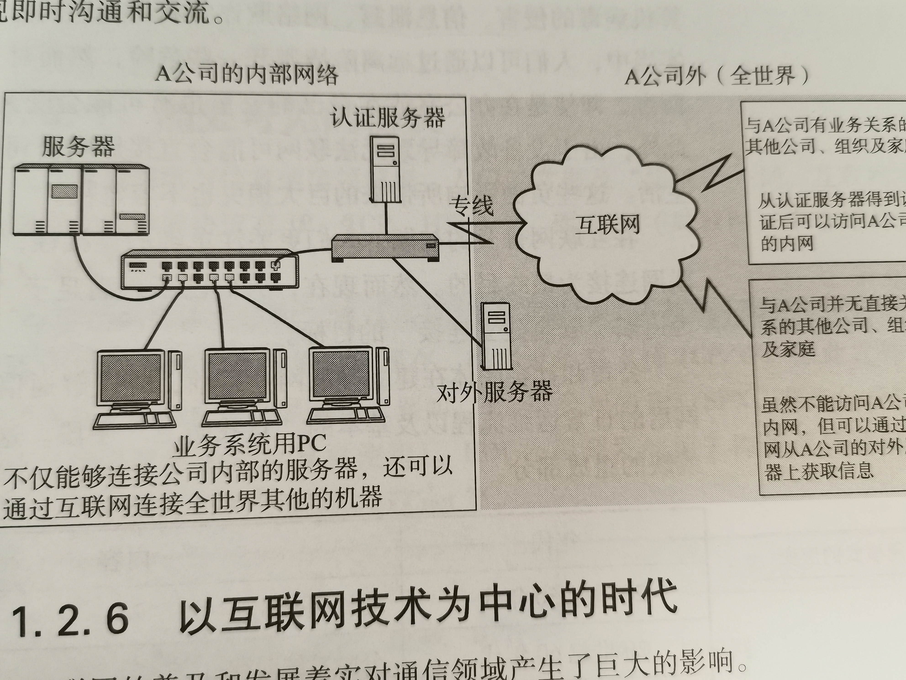
#### 1.2.6以互联网技术为中心的时代
**通过IP网，人们不仅可以实现电话通信、电视广播，还能实现计算机之间的通信，建立互联网。**
#### 1.2.7从单纯建立连接到安全连接
####1.2.8 手握金刚钻的TCP/IP
**互联网是由许多独立发展的网络通信技术融合而成，能够使它们之间不断融合并实现统一的正是TCP/IP技术**

### 1.3 协议
*在计算机网络与通信领域里，人们经常提及“协议”一词，互联网中长用的具有代表性的协议有IP、TCP、HTTP的等。*
**计算机网络体系结构将这些网络协议进行了系统的归纳，TCP/IP就是IP、TCP、HTTP等协议的集合** 
**简单来说，协议就是计算机与计算机之间通过网络实现通信时事先达成的一种“约定”。这种约定使得右那些不同厂商的设备，不同的CPU以及不同的操作系统组成的计算机之间，只要遵循相同的协议就能够实现通信。反之，如果所使用的协议不同，就无法实现通信。** 
>协议可以分为很多种，每种协议都明确地界定了它的行为规范。  

>在计算机通信中，事先达成一个详细的约定，并遵循这一约定进行处理。这种约定其实就是协议。

#### 1.3.1分组交换
分组交换协议 
**分组交换：将大数据分割成一个个叫做包（Packet)的较小单位进行传输的方法。** 
*计算机通信会在每一个分组中附加源主机地址和目标主机地址送给通信线路，这些发送端地址、接收端地址以及分组序号写入的部分称为报文首部。一个较大的数据被分为多个分组时，为了标明是原始数据中的哪一部分，就有必要将分组的序号写入包中。接收端会根据这个序号，在将分组按照序号重新装配为原始数据。*
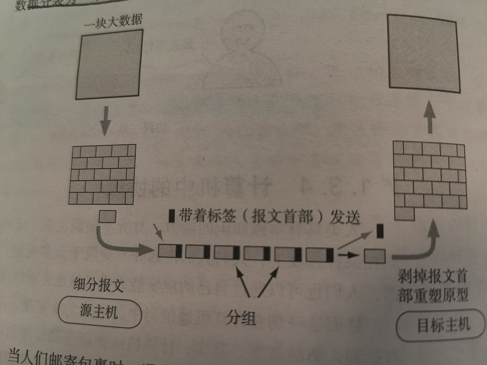
### 1.5协议分层与OSI参考模型
#### 1.5.1协议的分层
*ISO在指定标准化OSI之前，对网络体系结构相关问题进行了充分奥伦，最终提出了作为通信协议涉及指标的OSI参考模型。这一模型将通信协议中必要的功能分成7层，通过这些分层，使得那些比较复杂的网络协议要更加简单化。* 
**在这一模型中，每个分层都接收由它下一层所提供的服务 ，并且负责为自己的上一层提供特定的服务。上下层之间进行交互时所遵循的约定叫做“接口”。同一层之间的交互所遵循的约定叫做“协议”** 
**协议分层就如同计算机软件中的模块化开发。osi希望实现从第一层到第七层的所有模块，并将它们组合起来实现网络通信。分层可以将每个分层独立使用，即使系统中某些分层发生变化，也不会波及整个系统。因此可以构造一个扩展性和灵活性都较强的系统，此外通过分层能够细分通信功能，更易于单独实现每个分岑的协议，并界定各个分层的具体责任和义务**
#### 1.5.2 OSI参考模型
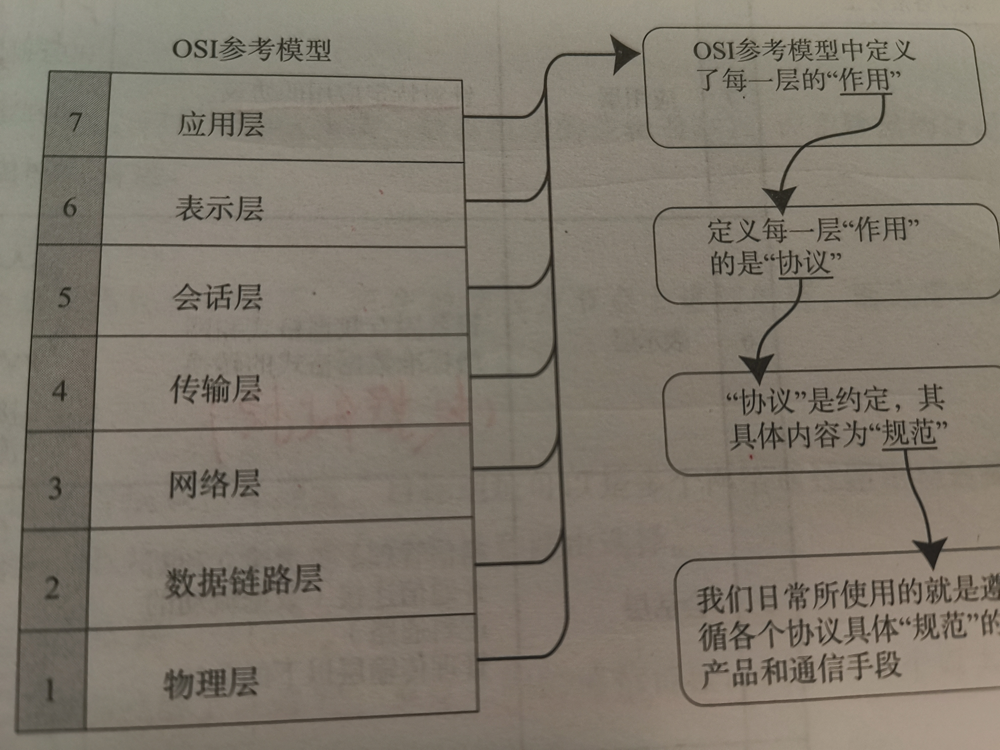
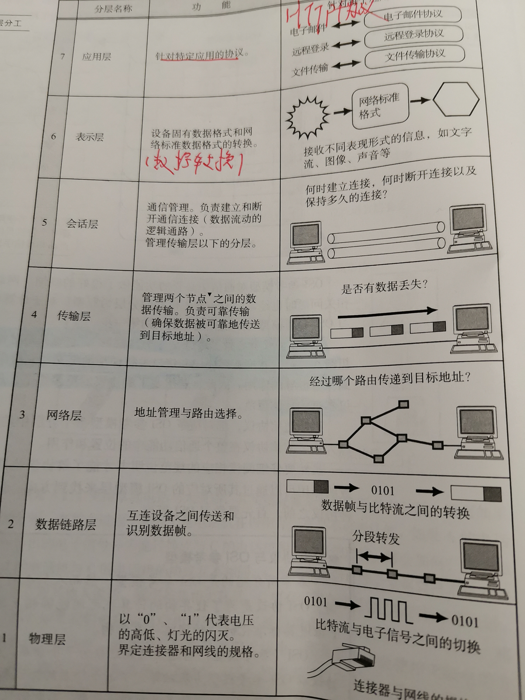

TCP/IP协议分层

层次|功能
-|-|
应用层|**决定了向用户提供应用服务时通信的活动，如FTP文件传输协议)和DNS。**|
传输层|**对上层应用层，提供处于网络连接中国的两台计算机之间的数据传输，如 TCP和UDP.**|
网络层|**c处理在网络上流动的数据包，数据包是网络传输的最小数据单位，该层规定了通过怎样的路径到达对方计算机，**|
链路层|**用来处理连接网络的硬件部分。**|

OSI协议分层

层次|功能
-|-|
应用层|**为应用程序提供服务并规定应用程序中通信的相关细节，包括文件传输、电子邮件、远程登录等协议。**|
表示层|**表示层是应用程序和网络之间的翻译官。在表示层，数据需要按照网络所能理解的方案的进行格式化。这种格式化因为使用网络的类型的不同而不同。表示层管理数据的加密和解密，例如银行账户，账户数据发送前加密，接受的时候对账户进行解密。**|
会话层|**建立通信链接，保持会话过程通信连接的畅通。同步两个节点之间的对话，决定通信是否被中断以及通信中断时决定从何处重新发送。(逻辑上）**|
传输层|**按照网络能处理的最大尺寸将教程的数据包进行强制分割，发送方节点的传输层将数据分割成交小的数据片，同时对每一个数据片安排一序列号，以便数据到达接收方的传输层时能以正确 的顺序重组，该过程称为排序。工作在传输层的两种服务是TCP/IP协议套中的TCP（传输控制协议），另一项传输层服务是IPX/SPX协议集的SPX**|
网络层|**将数据传输到目标地址，目标地址可以是多个网络通过路由器连接而成的某一个地址，因此这一层主要负责寻址和路由选择。**|
数据链路层|**主要是对物理层传输的比特流包装，检测保证数据传输的可靠性，将物理层接收的数据进行MAC（媒体访问控制）地址的封装和解封装，也可以简单的理解为物理寻址。交换机就处在这一层，最小的传输单位——帧**|
物理层|**定义物理设备的标准，主要对物理连接方式，电气特性，机械特性等制定统一标准，传输比特流，因此最小的传输单位——位;一切看得到摸得着的无力硬件，例如：网线、光猫、路由器、交换机****（**|

*  **在应用层写入的数据会经由表示层格式化编码、再由会话层标宋顺序发送出去；然而会话从只对何时建立连接、何时发送数据等问题进行管里，并不具有实际传输数据的功能，真正负责网络上传输数据的是会话层以下的无名英雄。**
* **会话层负责决定建立连接和断开链接的时机，而传输层进行实际的建立和断开处理。**
* 

* IP地址工作在OSI参考模型的第三层网络层。两者之间分工明确，默契合作，完成通信过程。IP地址专注于网络层，将数据包从一个网络转发到另外一个网络；而MAC地址专注于数据链路层，将一个数据帧从一个节点传送到相同链路的另一个节点。
* 工作在数据链路层的交换机维护着计算机MAC地址和自身端口的数据库，交换机根据收到的数据帧中的“目的MAC地址”字段来转发数据帧。在一个稳定的网络中，IP地址和MAC地址是成对出现的。如果一台计算机要和网络中另一外计算机通信，那么要配置这两台计算机的IP地址，MAC地址是网卡出厂时设定的，这样配置的IP地址就和MAC地址形成了一种对应关系。在数据通信时，IP地址负责表示计算机的网络层地址，网络层设备（如路由器）根据IP地址来进行操作；MAC地址负责表示计算机的数据链路层地址，数据链路层设备（如交换机）根据MAC地址来进行操作。IP和MAC地址这种映射关系由ARP（Address Resolution Protocol，地址解析协议）协议完成。
* 早期的时候，数据链路层就是来对电信号来做分组的。以前每个公司都有自己的分组方式，非常的乱，后来形成了统一的标准（标准就是协议），即以太网协议Ethernet。

白话解释参考： <https://blog.csdn.net/taotongning/article/details/81352985>

### 1.7传输的分类
#### 1.7.1面向有连接和面向无连接

* 面向有连接： 在发送数据之前，需要在收发主机之间连接一条通信线路。
* 面向无连接：不要求建立和断开链接，发送端可于任何时候自由发送数据， 

#### 1.7.2电路交换与分组交换 
* 电路交换：交换机主要负责数据的中转处理，计算机主要负责数据的中转处理。计算机首先被链接到交换机上，而交换机和交换机之间则由众多通信线路再继续链接。因此计算机之间在发送数据时，需要通过交换机与主机建立通信电路。我们将链接电路称为建立连接，联立好连接后，用户就可以一直使用这条电路，直到该连接被断开位置。 
* 分组交换：让连接到通信电路的计算机将所要发的数据分成多个数据包，按照一定的顺序排列之后分别发送，有了分组交换，数据被细化后，所有的计算机就可以一齐收发数据，这样也就提高了通信线路的利用了吧。大致过程：发送端计算机将数据分组发送给路由器，路由器收到这些分组数据后，缓存到自己的缓冲区，然后再转发给目标计算机。

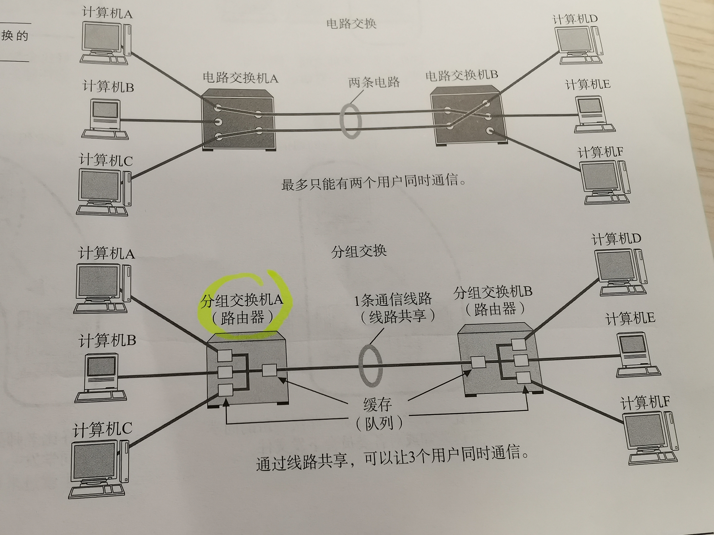

#### 1.7.3根据接收端的数量分类

* 单播：1对1通信
* 广播：所有计算机（限同一数据链路内）
* 多播：特定组内的通信
* 任播：特定组内的任意一台计算机 

### 1.8地址

TCP/IP通信中使用MAC地址、IP地址、端口号。

#### 1.8.1地址的唯一性

#### 1.8.2地址的层次性
*当地址数量并不是很多的情况下，有了唯一地址就可以定位相互通信的主体。然而，当地址的总数越来越多时，如何高效地从中找出通信的目标地址将成为一个重要的问题，为此人们发现地址出了具有唯一性还需要具有层次性。*
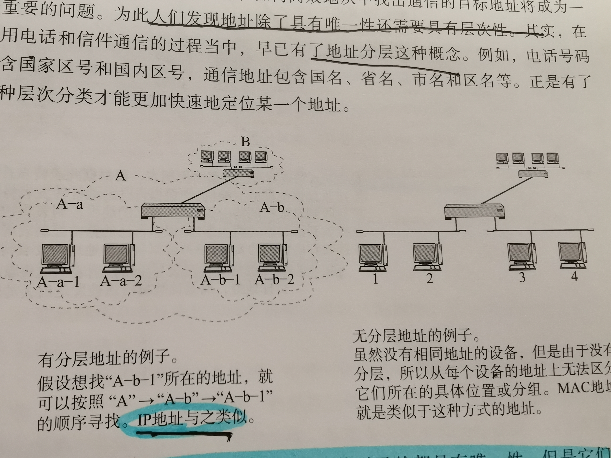
**MAC地址和IP地址在标识一个通信主体时虽然都具有唯一性，但是它们当中只有IP地址具有层次性。** 
**MAC地址由设备的制造厂商针对每块网卡进行分别指定、** 
**IP地址由网络号和主机号两部分组成，即使通信主体的IP地址不同，若主机号不同，网络号相同，说明它们处于同一个网段。** 
*通常，同处一个网段的主机也都属于同一个部门或集团组织，另一方面，网络号相同的主机在组织结构、提供商类型和地域分布上都比较集中，也为IP寻址带来了极大的方便，这也是为什么说IP地址具有层次性的原因* 

### 1.9网络的构成要素（硬件）
**搭建一套网络环境要涉及各种各样事物电缆和网络设备。**

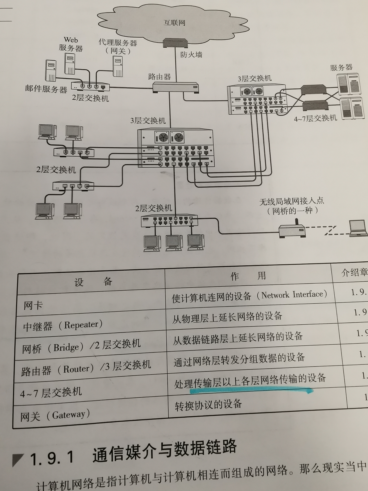

#### 1.9.1通信媒介与数据链路
**计算机之间通过电缆相互连接，电缆可以分为很多种，包括双绞线电缆、光纤电缆、同轴电缆、串行电缆等。**

#### 1.9.2网卡
**任何一台计算机连接网络时，必须使用网卡（全城网络接口卡）。网络接口卡（NIC)有时也被叫做网络适配器、网卡、LAN卡。** 
#### 1.9.3 中继器
**中继器是在OSI模型-第一层物理层面上延长网络的设备。由电缆传过来的电信号或光信号经由中机器的波形调整和放大再传给另一个电缆。**

* 中继器是对减弱的信号进行放大和发送的设备。
* 中继器通过对物理层的链接延长网络
* 即使在数据链路层出现某些问题，中继器任然可以转发数据。 
* 中继器无法改变传输速度 

有些中继器可以提供多个端口服务，这种中继器被称作中继集线器或集线器。**因此，集线器可以看做是多口中继器，每个端口都可以看成一个中继器。**  
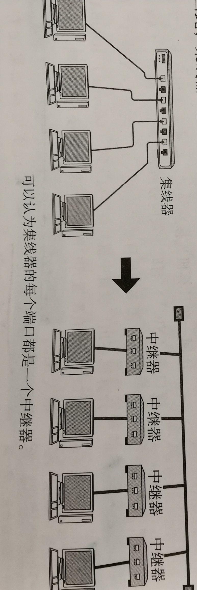

#### 1.9.4 网桥/2层交换机
 **网桥工作在数据链路层，将两个LAN连起来，根据MAC地址来发帧，可以看做是一个 低层路由器（路由器工作在网络层，根据网络地址）** 

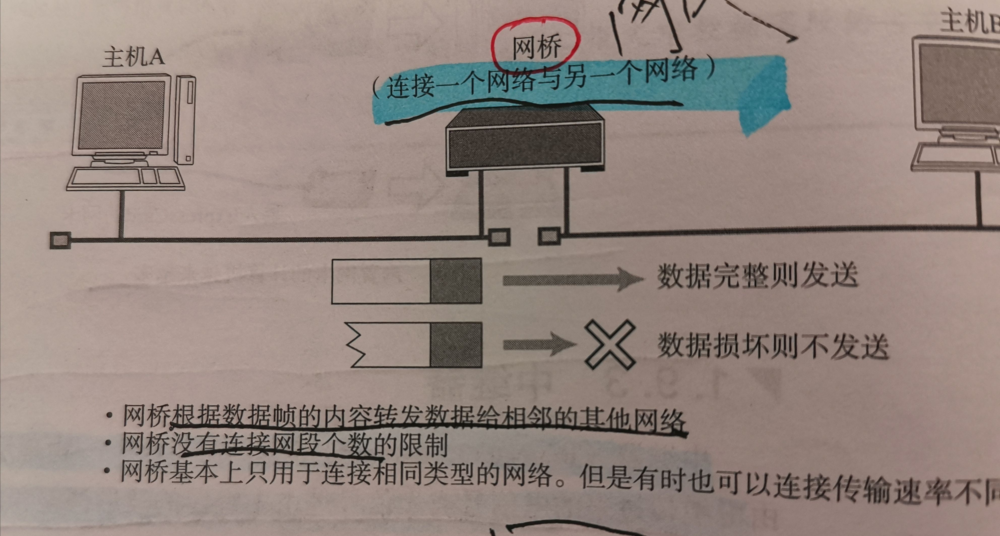
	
* 网桥是在OSI模型的第二层-数据链路层面上链接两个网络的设备。它能够识别数据链路层的数据帧，并将这些数据帧临时存储于内存，再重新生成信号作为一个全新的帧转发给相连的一个网段。
* 数据链路的数据帧中还有一个数据位叫做FCS,用以校验数据是否正确送达目的地。网桥通过检查这个域中的值，将那些损坏的数据丢弃，从而避免发送给其他网段。此外，网桥还能通过地址自学机制和过滤功能控制网络流量。
* 有些网桥能够判断是否将数据转发给相邻的网段，这些网桥被称为自学式网桥。这类网桥会记住曾经通过自己转发的所有数据帧的MAC地址，并保存到自己的内存表中。由此，可以判断哪个网段中包含持有哪类MAC地址。
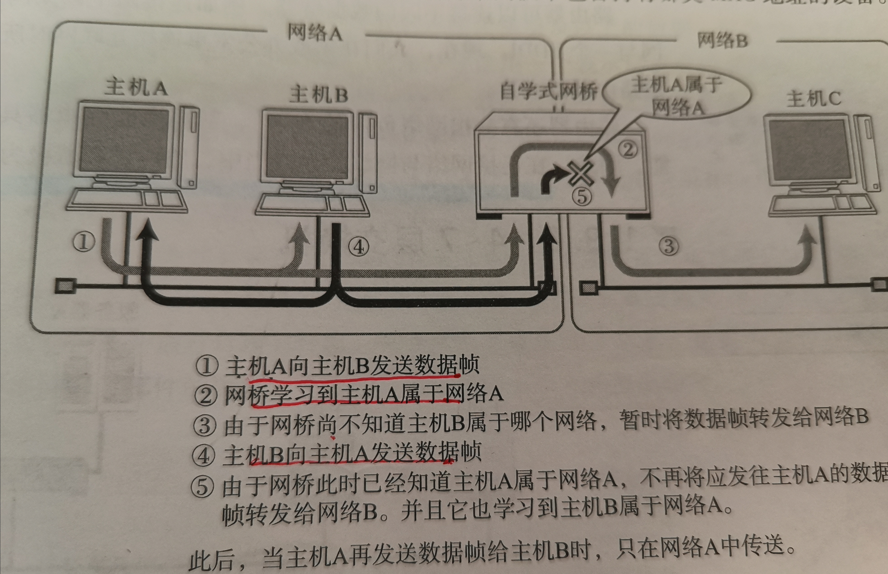

**以太网等网络中使用的交换集线器，现在基本也属于网桥的一种，交换集线器中链接电缆的每个端口都能提供类似网桥的功能。**

#### 1.9.5 路由器/3层交换机
	路由器是在OSI模型的第3层-网络层面上链接两个网络、并对分组报文进行转发的设备。网桥是根据物理地址（MAC地址）进行处理，而路由器/3层交换机则根据IP地址进行处理。由此，TCP/IP地址就成为了IP地址。
**路由器可以连接不同的数据链路，例如两个以太网。**

#### 1.9.6 4~7层交换机
**4-7层交换机负责处理OSI模型中从传输层之应用蹭的数据**

* **负载均衡器**
* **带宽控制**
* 广域网加速器
* 特殊应用访问加速器
* 防火墙
*

#### 1.9.7网关
**网关是OSI参考模型负责将传输层到应用层的数据进行转换和转发的设备。它与4~7层交换机一样都处理传输层以上的数据，但是网关不仅转发数据还负责对数据进行转换，它通常会使用一个表示层或应用层网关，在两个不能直接通信的协议之间进行翻译，最终实现二者的通信。** 
*一个非常典型的例子就是互联网邮件和手机邮件之间的转换服务，手机邮件有时可能会与互联网邮件不兼容，这时由于他们在表示层和应用层中的点子邮件协议互不相同所导致的。*
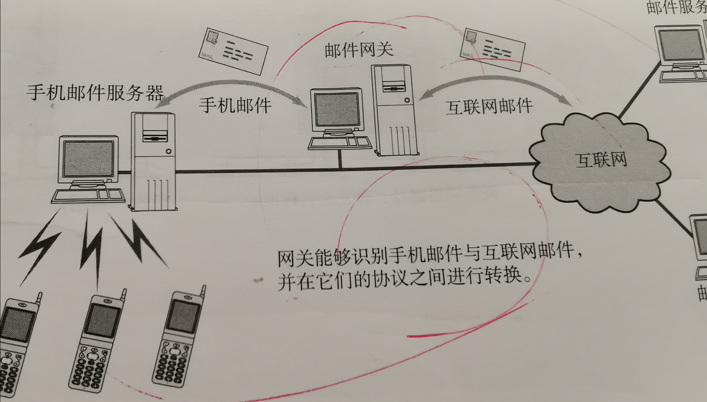

### 1.10现代网络