## 2、TCP/IP基础知识
**TCP(Transmission Control Protocol)和IP（Internet Protocol)是互联网的众多通信协议中最为著名的。** 
### 2.1TCP/IP的标准化

#### 2.1.1 TCP/IP的具体含义
TCP/IP：利用IP进行通信时所必须用到的协议群的统称。 
具体说来，IP或ICMP、TCP或UDP、TELENT或FTP、以及HTTP等都属于TCP/IP协议。它们与TCP/Ip的关系密切，是互联网必不可少的部分。TCP/IP一词泛指这些协议，因此，有时也称为TCP/IP网际协议族。 

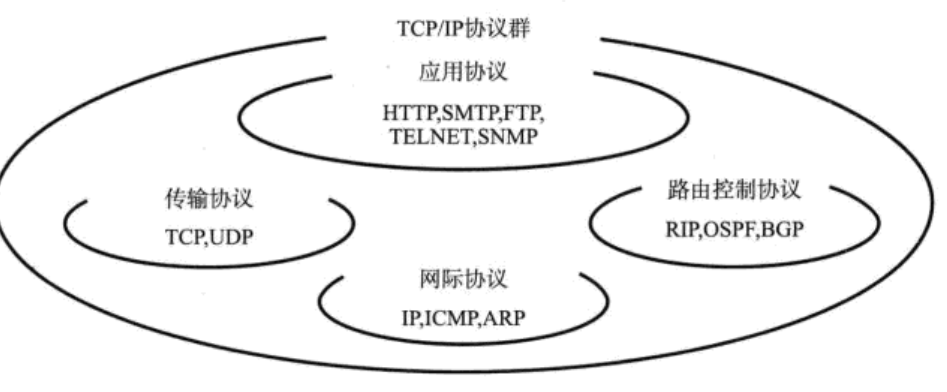

### 2.2 互联网基础知识
#### 2.2。1互联网定义
**互联网是指由ARPANET发展而来、互联全世界的计算机网络。现在。互联网已经是一个专有名词。**

#### 2.2.2互联网与TCP/IP的关系
**互联网进行通信时，需要相应的网络协议，TCP/IP原本就是为使用互联网而开发定制的协议族，因此互联网的协议就是TCP/IP，TCP/IP就是互联网的协议。**

#### 2.2.3互联网的结构
互联网一词原来的意思就是网际网，意指连接一个又一个网络。name连接全世界的网络也是如此。较小范围的网络之间相连组成机构内部的网络，机构内部的网络之间相连再形成区域网络，而各个区域网络之间再互联，最终就形成了连接全世界的互联网。互联网就是按照这样的形式构成了一个有层次的网络。 

**互联网中的每个网络都是由骨干网（BackBone)和末端网（Stub)组成的。每个网络之间通过NOC(Net Operation Center:网络操作中心)，相连。如果网络的运营商不同，它们的网络连接方式和使用方法也会不同。连接这种异构网络需要IX(Internet Exchange)的支持。总之，互联网就是众多异构网络通过IX互联的巨型网络。** 
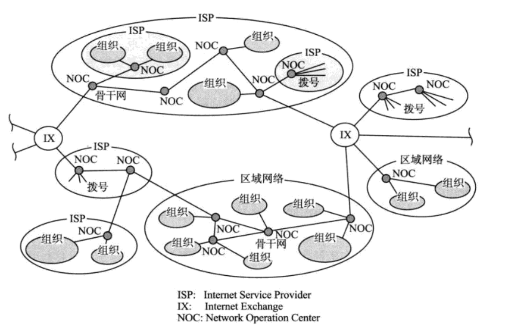

### 2.3 TCP/IP协议分层模型
#### 2.3.1TCP/IP与osi参考模型

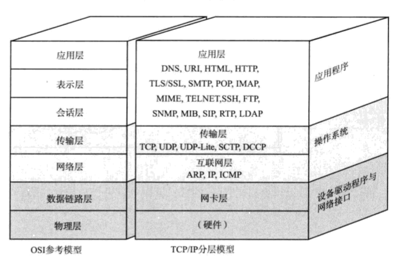

**OSI参考模型注重“通信协议必要的功能是什么”，而TCP/IP协议则更强调 “在计算机上实现协议应该开发哪种程序。”**

---
#### 2.3.2 硬件（物理层）
**TCP/IP的最底层是负责数据传输的硬件。这种硬件就相当于以太网或电话线路等物理设备层的设备。TCP/IP是在网络互连的设备之间能够通信的前提下才被提出的协议。**

---
#### 2.3.3网络接口层（数据链路层）
**网络接口层利用以太网中的数据链路层进行通信。**

---
#### 2.3.4互联网层（网络层)

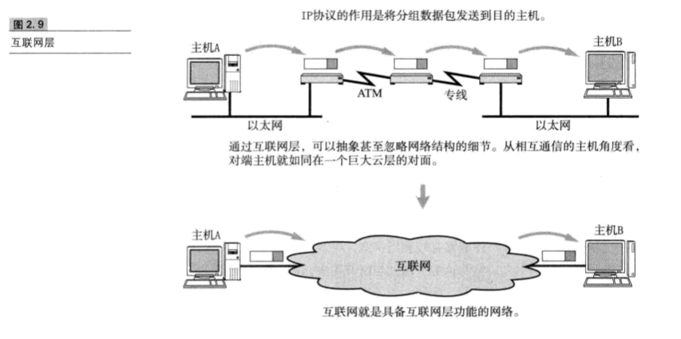

**互联网层使用IP协议，它相当于OSI模型中的第3层网络层。IP协议基于IP地址转发分包数据。** 

**TCP/IP分层中的互联网层与传输层的功能通常由操作系统提供，尤其是路由器，它必须实现通过互联网层转发分组数据包的功能** 

IP 
**IP是亏越网络传输数据包，使整个互联网都能收到数据的协议。IP协议使数据能够发送到地球的另一端，这期间它能使用IP地址作为主机的标志，** 
**IP还隐含着数据链路层的功能，通过IP,相互通信的主机不论经过怎样的底层数据链路都能够实现通信** 
**虽然IP也是分组交换的一种协议，但它不具备重发机制。即使分组数据包未能到哒对端主机也不会重发，因此属于非可靠性传输协议。**

ICMP 
**ip数据包在发送途中一旦发生异常导致无法到达对端目标地址时，需要给发送端发送一个异常的通知。ICMP就是为这一功能而定制的，有时也被用来诊断网络的健康状况** 

ARP 
**从分组数据包的IP地址中解析出物理地址（MAC地址)的一种协议。**

----

#### 2.3.5传输层

**传输层最主要的功能就是能够让应用程序之间实现通信，计算机内部，通常同一时间运行着多个程序。为此,必须分清是哪些程序在进行通信。识别这些应用的程序的是端口号。** 
TCP 
**TCP是一种面向连接的传输层协议。它可以保证两端通信主机之间的通信可达。TCP能够正确处理在传输过程中丢包、传输顺序乱掉等异常情况。此外，TCP还能够有效利用带宽，缓解网络拥堵。**

UDP 
**UDP有别于TCP，它是一种面向无连接的传输层协议。UDP不会关注对端是否真的收到传送过去的数据。** 

----

#### 2.3.6 应用层

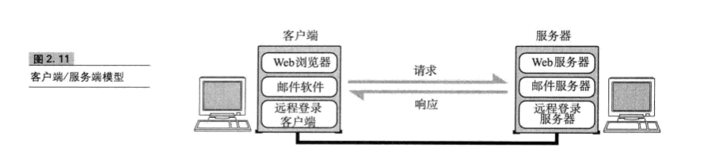 
**TXP/IP的分层中，将OSI参考模型中的会话层、表示层和应用层的功能都集中掉了应用程序中实现。将这些功能有时由一个单一的程序实现，有时可能会由多个程序实现。因此，细看TCP/IP的应用程序，它不仅实现OSI模型中华应用层的内容，还要实现会话层与表示层的功能。** 

*TCP/IP应用程序的架构绝大多数都属于客户端/服务器模型。提供服务的程序叫服务端，接收服务的程序叫客户端。在这种通信模式中，提供服务的程序会预先被部署到主机上，等待接收任何时刻客户可能会发送的请求。* 

**客户端可以随时发送请求给服务端。有时服务端可能会处理异常、超出负载等情况，这时客户端可以在等待片刻后重发一次请求。** 
WWW 
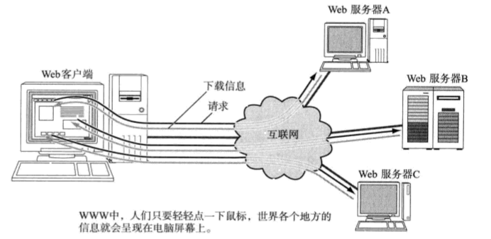 
**浏览器和服务端之间通信所用的协议是HTTP(HyperText Transfer Protocol)所传输数据的主要格式是HTML(HyperText Markup Language)。WWW中的HTTP属于OSI应用层的协议，而HTML属于表示层的协议。** 

SMTP 
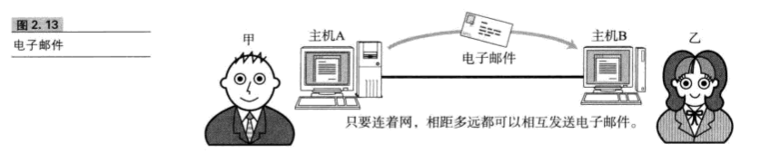 
FTP 
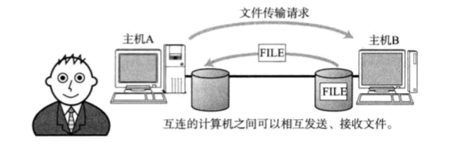 
**文件传输是指将保存在其他计算机硬盘上的文件转移到本地的硬盘上，或将本地硬盘上的文件传送到其他机器硬盘上的意思。** 
**该过程使用的FTP(File Transfer Protocol).**

TELNET 与SSH 
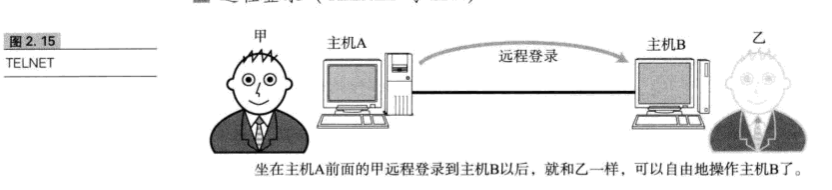 
**远程登录是指登录到远程的计算机上，使那台计算机上的程序得以运行的一种功能。TCP/IP网络中远程登录常用TELNET和SSH两种协议。**

----
### 2.4TCP/IP分层模型与通信示例

#### 2.4.1 数据包首部
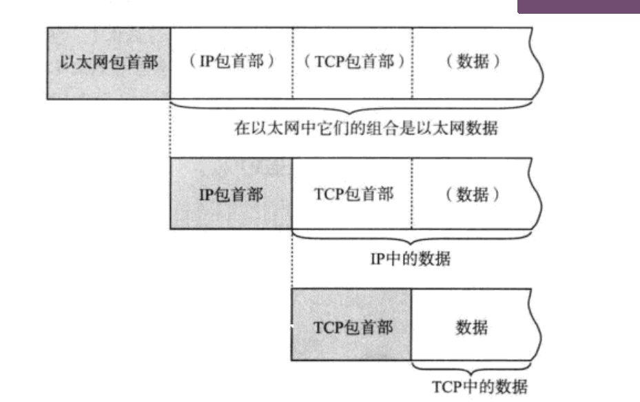
**每个分层中，都会对发送的数据附加一个首部，在这个首部中包含了该层的必要信息，如发送的目标地址以及协议相关信息。通常，为协议提供的信息为包首部，所要发送的内容为数据，在下一层的角度看，从上一分层收到的包全部都被认为是本层的数据。** 

*包、帧、数据包、段、信息*

以上5个术语都用来表达数据的单位，大致区分如下：

* 包：全能型术语
* 帧：表示数据链路层中包的单位
* 数据报：IP和UDP等网络层以上的分层中包的单位
* 段：表示TCP数据流中的信息
* 消息：应用协议中数据的单位

**网络中传输的数据包由两部分组成：一部分是协议中要用到的首部，另一部分是上层穿过来的数据** 
*首部的结构由协议的具体规范详细定义，例如，识别上一层协议的域应该层包的哪一位开始取多少比特、如何计算校验并插入包的哪一位等。互相通信的两端计算机如果在识别协议的序号以及校验和的计算方法上不一样，就根本无法实现通信。* 
**因此，在数据包的首部，明确标明了协议应该如何读取数据。反过来说，看到首部，也就能够了解协议必要的信息以及所要处理的内容。**
 

#### 2.4.2发送数据包
假设甲给乙发送电子邮件，内容为：“早上好”。而从TCP/IP通信上看，是一台计算机A向另外一台计算机B发送电子邮件。 

(1)应用程序处理 
①启动应用程序新建邮件，将收件人邮箱填好，再由键盘输入内容"早上好"，鼠标点击“发送”按钮就可以开始 TCP/IP的通信了. 
②应用程序会进行编码处理，例如日文电子邮件使用ISO-2022-JP或UTF-8进行编码。这些编码相当于OSI的表示层的功能。 
③编码转化后，实际邮件不一定会马上发送出去，因为有些邮件的软件有一次同时发送多个邮件的功能，也可能用户点击“收心3”按钮以后才一并接收新邮件的功能。像这种何时建立通信连接何时发送数据的管理功能，从某种宽泛的意义上属于OSI模型中会话从。 

(2)**TCP模块的处理** 
①TCP根据应用的指示，负责建立连接、发送数据以及断开链接。TCP提供将应用层发来的数据顺利发送至对端的可靠传输.  
②为了实现这一功能，需要在应用层数据的前端附加一个TCP首部。TCP首部包括源端口号和目标端口号（用以识别发送主机跟接收主机的应用）、序号（用以表示该包中数据是发送端整个数据中第及字节的序列号）以及校验和（用以判断数据是否被损坏）。随后附加TCP首部的包再发送给IP。 

(3)**IP模块的处理** 
①IP将TCP穿过来的的TCP首部和TCP数据合起来当做自己的数据，并在TCP首部的前端再加上自己的IP首部。因此，IP数据包中的IP首部后面紧跟着TCP首部，然后才是应用数据首部和数据本身。IP首部中包含接收端IP地址以及发送端IP地址。紧随IP首部的还有用来判断其后面数据是TCP还是UDP的信息.  
②IP包生成后，参考路由控制表决定接受此IP包的路由和主机。随后，IP包将被被发送给连接这些路由器或主机网络接口的驱动程序。以实现真正的发送数据。 
(4)**网络接口（以太网）的处理** 
①从IP穿过来的IP包，对于以太网驱动来说不过就是怇。给这数据附加上以太网首部并进行发送处理。  
②以太网首部中包括接收端MAC地址、发送端MAC地址以及标志哦以太网类型的医药网数据的信息，。
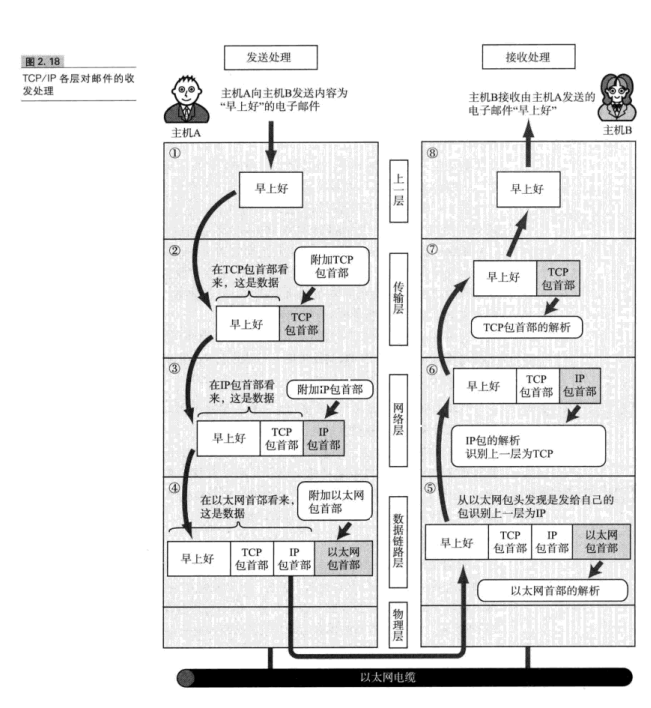

(5)**经过数据链路的包** 
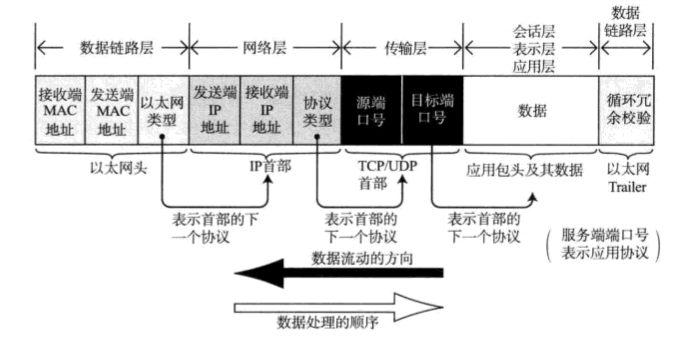

① **包流动时，从前往后依次被附加了以太网首部、IP包首部、TCP包首部（或者UDP包首部）以及应用自己的包首部和数据。而包的最后则追加了以太网的包尾/**  
②**每个包首部中至少都会包含两个信息：一个是发送端和接收端地址，另一个是上一层的协议类型**  
③**经过每个协议时，都必须有识别包发送端和接收端的信息，以太网会用mac地址，IP会用IP地址，而TCP/UDP则会用端口号识别量端主机的地址。这些信息都在每个包经由各个分层时，附加到协议对应的包首部里边。** 

数据包接收处理 
**包的接收是发送流程的逆序过程** 
(6)**网络接口（以太网驱动的处理）** 
①主机收到以太网的包后，首先从以太网的包首部找到MAC地址判断是否为发送给自己的包，如果不是发给自己的包则丢弃数据 
 
②如果接收到了恰是发给自己的包，就查找以太网包首部中的类型域从而确定以太网协议所传送过来的数据类型。在这个例子中数据类型显然是IP包，因此再将数据传送给处理IP的子程序，如果这时不是IP而是其他诸如ARP的协议，就把数据传给ARP处理。总之，如果以太网首部的类型域包含了一个无法识别的协议类型则丢弃数据. 
 
(7)**IP模块的处理** 
① IP模块收到IP包首部及后面的数据包部分以后，也做类似的处理 
②如果判断得出包首部中的IP地址与自己IP地址匹配，则可接收数据并从中查找出上一层的协议。如果上一层是TCP九江IP包首部之后创给TCP处理；如果是UDP就IP包首部后面的的部分创给UDP处理。 
(8)**TCP模块的处理** 
**在TCP模块中，首先会计算一下校验和，判断数据是否被破坏。然后检查是否在按照序号接收数据，最后检查端口号，确定具体的应用程序** 
**数据接收完毕后，接收端则发送一个确认回执给发送端。如果这个回执信息文能到达发送端，那么发送端则认为接收端没有收到数据而一直反复发送** 
**数据被完整地接收以后，会传给由端口号识别的应用程序。** 

(9)**应用程序的处理** 
