## 3、数据链路
**本章主要介绍计算机网络最基本的内容-数据链路层。如果没有数据链路层，基于TCP/IP的通行就无从谈起。**

### 3.1数据链路的作用

	数据链路，指OSI参考模型中的数据链路层，有时也指以太网、无线局域网等通信手段。

**数据链路层的协议定义了通信媒介互联的设备之间传输的规范。通信媒介包括双绞线电缆，同轴电缆、光纤、电波以及红外线灯介质。此外，各个设备之间有时会通过交换机、网桥、中继器等中转数据。** 

	数据链路层处理的数据不再是单纯的0、1序列，该层把它们集合为一个叫做帧的块，然后再进行传输。

	数据链路也可以被视为网络传输中最小的单位。
	
	其实仔细观察连通全世界的互联网就可以发现，它也不外乎是由众多这样的数据链路组成的。

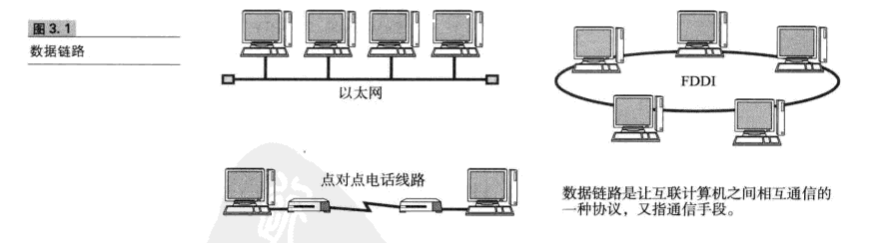

**网络拓抪** 
*网络的链接和构成的形态称为网络拓抪（Topology）。网络拓抪包括总线型、环型、星型、网状型等。拓抪一词不仅用于直观可见的配线方式，也用于逻辑上网络的组成结构*。
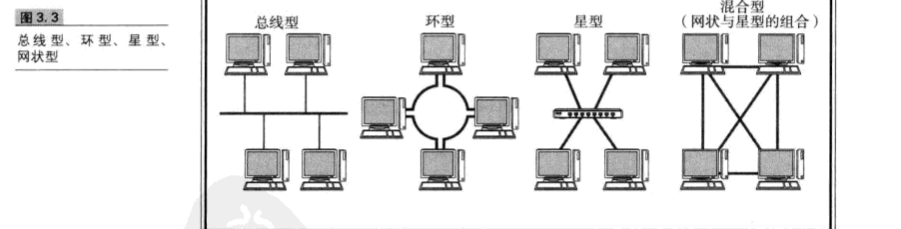

### 3.2数据链路层相关技术

#### 3.2.1 MAC地址

**MAC地址用于识别数据链路中互连的节点。通过MAC地址判断目标地址。**
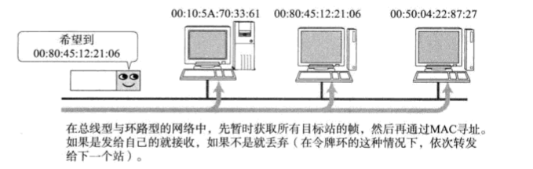
 
**MAC地址长48比特，在使用网卡（NIC)的情况下，MAC地址地址一般会被烧入到ROM中，因此，任何一个网卡的MAC地址都是唯一的，在全世界都不会有重复。** 
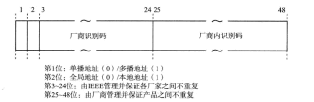
 

**IEEE802.3制定地址规范时没有限定数据链路的类型，即不论哪种数据链路的网络（以太网、FDDI、ATM、无线LAN、蓝牙等），都不会有想听的MAC地址出现** 

#### 3.2.2 共享介质型网络

**从通信介质（通信，介质）的使用方法上看，网络可分为共享介质型和非共享介质型。** 
	
	共享介质型网络是指由多个网络设备共享一个通信介质的一种网络。最早的以太网和FDDI就是共享介质型网络。
	在这种方式下，设备之间使用同一个载波信道进行发送和接收。
	为此，基本采用半双工通信方式，并有必要对介质进行访问控制。

**共享介质型网络中有两种介质访问控制方式：一种是争用方式，另一种是令牌传递方式。** 

争用方式 
*争用方式是指争夺获取数据传输的权利，也叫CSMA(载波监听多路访问)。这种方法通常玲网络中的各个站采用先到先得的方式占用信道发送数据，如果多个站同时发送帧，则会产生冲突现象。因此会导致网络拥堵和性能下降* 
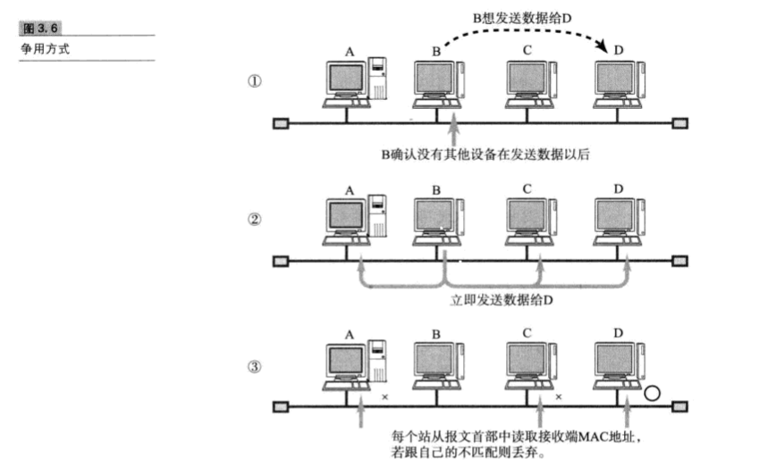

 令牌传递方式 

*令牌传递方式是沿着令牌环发送一种叫做“令牌”的特殊报文，是控制传输的一种方式。只有获得令牌的站才能发送数据。这种方式有两个特点：一是不会有冲突，二十每个站都有通过平等循环获得令牌的机会。因此，即使网络拥堵也不会导致性能下降。* 
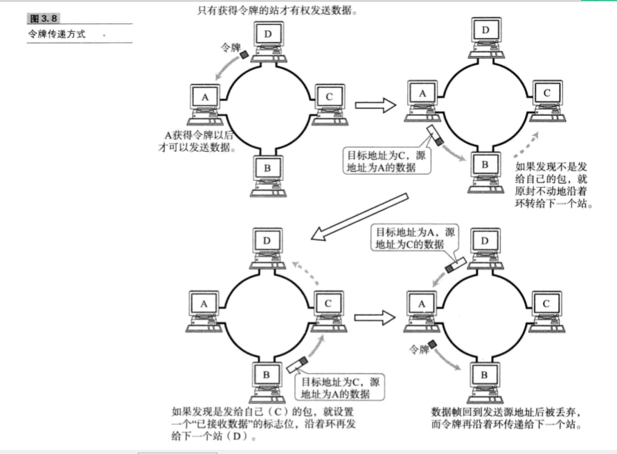

#### 3.2.3非共享介质网络
**非共享介质网络是指不共享介质，是对介质采取专用的一种传输控制的方式。在这种方式下，网络中每个站直连交换机，由交换机负责转发数据帧。此方式下，发送端与接收端并不共享通信介质，因此很多情况下采用全双工通信方式。** 

*不仅ATM采用这种传输控制方式，最近它也称为了以太网的主流方式。通过以太网交换机构建网络，从而使得计算机与交换机端口之间形成一对一的链接，即可实现全双工通信。* 

*该方式还可以根据交换机的高级特性构建虚拟局域网、进行流量控制等。当然，这种方式也有一个致命的弱点，那就是一旦交换机发生故障，与之相连的所有计算机之间都将无法通信* 
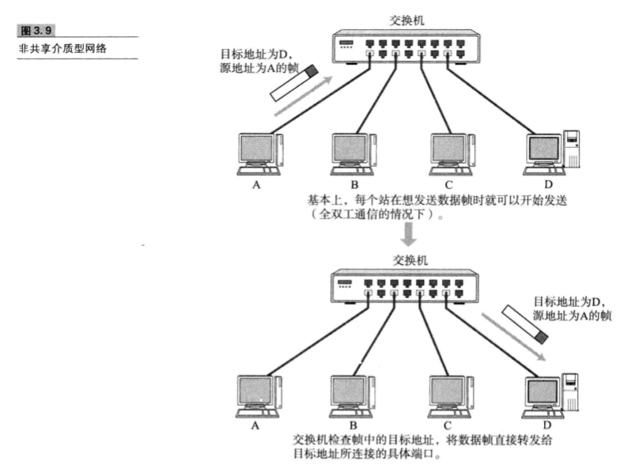

#### 3.2.4 根据MAC地质转发
	
	在使用同轴电缆的以太网等介质共享网络中，同一时间只能有一台爱主机发送数据。当联网的主句数量增加时，通信性能会明显下降。
	若将集线器或集中器等设备以星型连接，就出现了一种新的网络设备--交换集线器，这是一种将非介质共享型网络中所使用的交换机用在以太网中的技术，交换集线器也叫做以太网交换机。

**以太网交换机就是持有多个端口的网桥，它们根据数据链路层中每个帧的目标MAC地址，决定从哪个网络接口发送数据。这时所参考的、用以记录发送接口的表就叫做转换表。** 
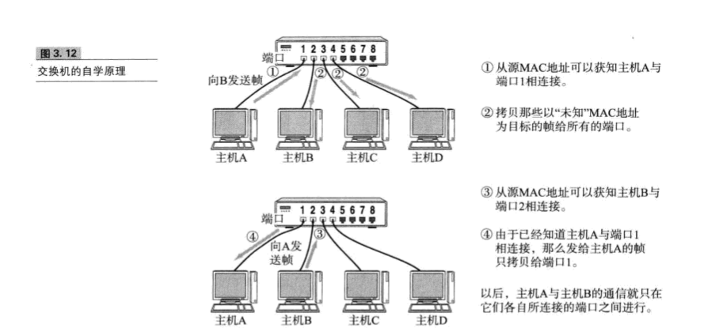

### 3.3、以太网

**在众多数据链路中最为著名、使用最为广泛的莫过于以太网。**

#### 3.3.1以太网连接形式
	
	在以太网普及之初，一般采用多台终端使用同一根电缆的共享介质型连接方式。
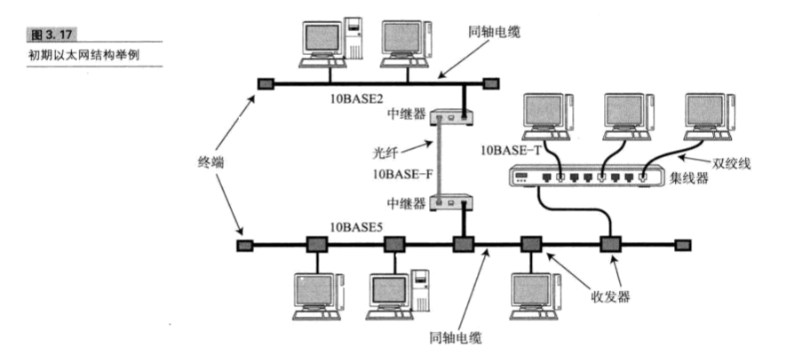
	
	而现在，随着互联网设备的处理能力以及传输速度的提高，一般都采用终端与交换机之间独占电缆的方式实现以太网通信。

#### 3.3.2以太网的分类
**以太网因通信电缆的不同以及通信速度的差异，衍生了众多不同的以太网类型。** 

#### 3.3.3 以太网帧格式
 **以太网前端有一个叫做前导码的部分，它由0、1数字交替组合而成，表示以太网帧的格式，也是对端网卡能够确保与其同步的标志。前端码末尾是一个叫做SFD(Start Frame Delimiter)的域，他的值是“11”。在这个域之后就是以太网帧的额本体、**

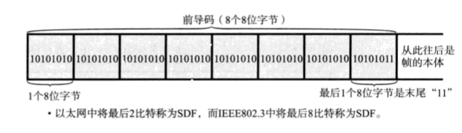

**以太网帧本体的前端是以太网的首部，它总共占14个字节。分别是6个字节的目标MAC地址、6个字节的源MAC地址以及2个字节的上层协议类型** 

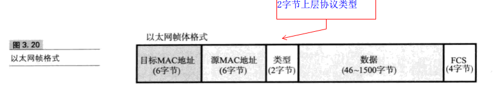

* 紧随帧头后面的数据。一个数据帧所能容纳的最大数据范围是46~1500个字节。
* 帧尾是一个叫FCS(Frame Check Sequence,帧检验序列)的4个字节。
* 目标MAC地址中存放了目标工作站的物理地址
* 源MAC地址存放可构造以太网帧的发送端工作站的物理地址
* 类型通常跟数据一起发送，它包含用以标志协议类型的编号：即表明以太网的再上一层网络协议的类型。在这个字段后面，则是类型所标志的协议首部及其数据。
* 帧尾最后出现的是FCS。用它可以检查帧是否有所损坏。在通信传输过程中如果出现电子噪声的干扰，可能会影响发送数据导致乱码位的出现。通过检查这个FCS字段的值可以将那些受到噪声干扰的错误帧丢弃。

### 3.4无线通信
	
	无线通信通常使用电磁波、红外线、激光灯方式进行传播数据。一般在办公室的局域网范围内组成的较高速的链接称为无线局域网。
	
	无线通信不需要网线或其他可见电缆。因此，早期无线通信主要用于轻量级的移动设备。

#### 3.4.1无线通信的种类

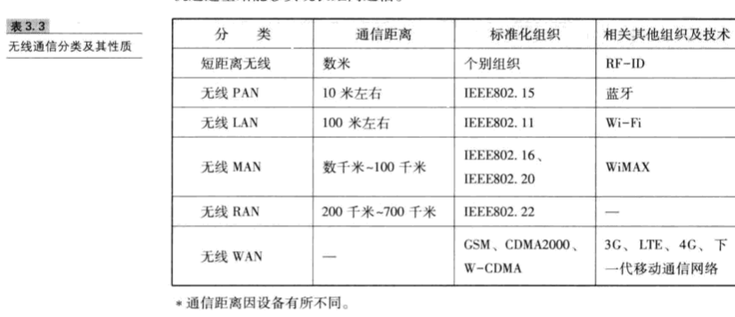

* 蓝牙
* WiMAX
* ZigBee

### 3.7 公共网络

	
	前面介绍了很多局域网链接相关的知识。
	
	所谓的公共通信服务类似于电信运营商(如NTT、KDDI）提供的电话网络。

	人们通过与这些运营商签约、付费不仅可以实现联网还可以与距离遥远的组织进行通信。

#### 3.7.1 模拟电话线路
	
	*模拟电话线路其实就是利用固定电话线路进行通信。电话线中的音频带宽用于拨号上网。该方法不需要特殊的通信线路，完全使用已经普及的电话网。*
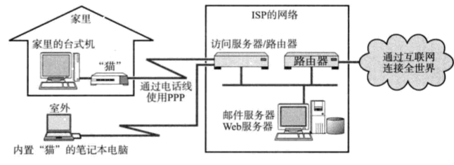

#### 3.7.2、移动电话通信
	特点：只要在服务区范围内，就可以连接到运营商的网络。

#### 3.7.3、ADSL

#### 3.7.4、FTTH
	
	FFTH:就是一根告诉光纤直接连到用户家里或公司建筑物出
	
	它通过一个叫做OUT的装置将计算机与之关联。该庄主负责在光信号与电子信号之间的转换，实现FTTH可以实现稳定的高速通信。
	
	不过他的线路传输速率与具体的服务内容仍受个别运用服务商限制。

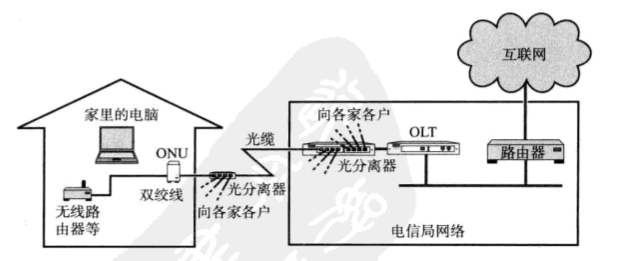

#### 3.7.5 有线电视

#### 3.7.6 专线

#### 3.7.7 VPN

#### 3.7.8公共无线LAN

