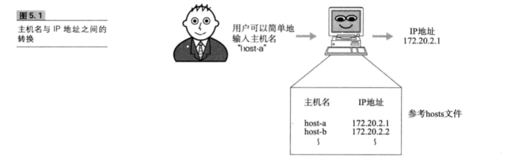
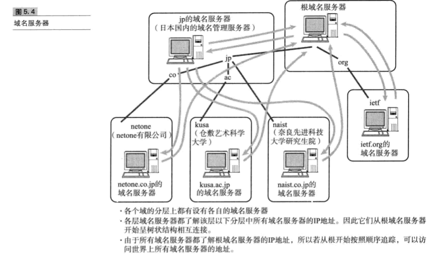
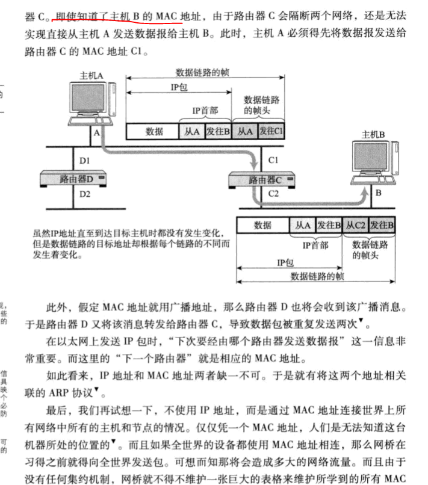
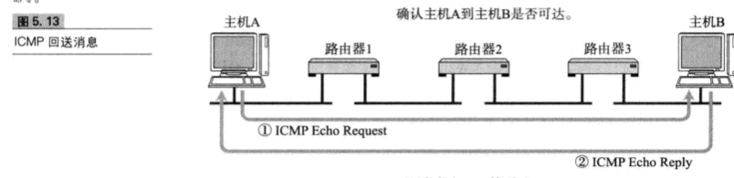
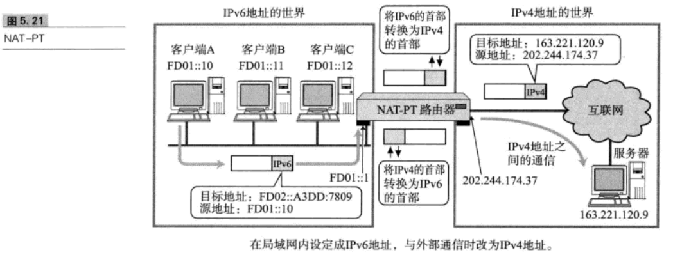
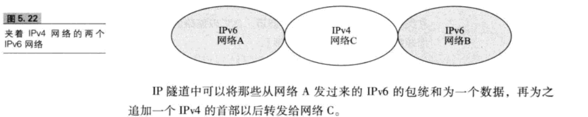

## 5、IP协议相关技术
	
	IP(Internet Protocol)旨在让最终目标主机收到数据包，但是在这一过程中仅仅有IP是无法实现通信的。

	必须还要由能够解析主机名称和MAC地址的功能，以及数据包在发送过程中异常情况处理的功能。

### 5.1仅凭IP无法实现通信

*在访问Web站点和发送、接收电子邮件时，我们通常会直接输入Web网站的地址或电子邮件地址那些应用层提供的地址，而不会使用由十进制数字组成的某个IP地址。因此，为了让主机根据实际的IP包进行通信，就有必要实现一种功能-将应用中使用的地址映射为IP地址。* 

*此外，在数据链路层也不适用IP地址。在以太网的情况下只使用MAC地址传输数据包。而实际上将众多IP数据包在网络上进行传送的就是数据链路本身，因此，必须了解发送端的MAC地址，如果不知道MAC地址，n那么通信就无从谈起。* 

*由此可知，在实际通信中，仅凭IP远远不够，还需要众多支持IP的相关技术才能够实现最终的通信*  

### 5.2 DNS
	

#### 5.2.1 IP地址不方便记忆

	TCP/IP世界从一开始就已经有了一个叫做主机识别码的东西，这种主机识别方式就是为每台计算机赋予唯一的主机名，
	
	在进行网络通信时可以直接使用主机名称而无需输入一大长传的IP地址，并且此时系统必须自动将主机名称转换为具体的IP地址。

	为了实现这一功能，主机往往会利用一个叫做Host的数据库文件。

#### 5.2.2、DNS的产生
	
*在上述的背景中，产生了一个可以有效管理主机名和IP地址之间对应关系的系统，那就是DNS系统。在这个系统中主机的管理机构可以对数据进行变更和设定。也就是说，它可以维护一个用来表示组织内部主机名和IP地址之间对应关系的数据库*  

**在应用中，当用户输入主机名（域名）时，DNS会自动检索哪个注册了主机名和IP地址的数据库，并迅速定位对应的IP地址。而且，如果主机名和IP地址需要进行变更时，也只需要在组织内部进行处理即可，而没有必要再向其他机构进行申请或报告。** 

#### 5.2.3 域名的构成
	
	域名是指为了识别主机名称和组织机构名称的一种具有分层的名称。

	域名由几个英文字母（或英文字符序列）用点号连接构成。

	在启用域名功能之前，单凭主机名还是无法管理IP地址，因为在不同的组织机构中不允许有相同的的主机。

	然而，当出现了带有层次结构的域名之后，每一个组织机构就可以自由的为主机命名了。

**域名服务器**  
**域名服务器是指管理域名的主机和相应的软件，它可以管理所在分层的域的相关信息。** 

*根部所设置的DNS叫做根域名服务器，它对DNS的检索数据功能起着至关重要的作用。根域名服务器中注册这根以下第一层域名服务器的IP地址。* 

**解析器**  
**进行DNS查询的主机和软件叫做DNS解析器。用户所使用的工作站或个人电脑都属于解析器。一个解析器至少要注册一个以上域名服务器的IP地址。通常，它至少包括组织内部的域名服务器的IP地址。**  

#### 5.2.4 DNS查询

**解析器为了调查IP地址，向域名服务器进行查询处理。接收这个查询请求的域名服务器首先会在自己的数据库进行查找。如果有该域名所对应的IP地址就返回。如果没有，则域名服务器再向上一层根域名服务器进行查询处理。因此，如图所示，从根开始对这课树按照顺序进行遍历，直到找到指定的域名服务器，并由这个域名服务器返回想要的数据。**  
**解析器和域名服务器将最新了解到的信息暂时保存到缓存里，这样，可以减少每次查询时的性能消耗。** 

#### 5.2.5DNS如同互联网中的分布式数据库

前面提到的DNS是一种通过主机名检索IP地址的系统。然而，它所管理的信息不仅仅是这些主机名和IP地址之间的映射关系。它还要管理众多其他信息。 
例如，主机名和IP地址的对应信息叫做A记录。反之，从IP地址检索主机名称的信息叫做PTR,此外，上层或下层域名服务器IP地址的映射关系叫做NS记录。 

### 5.3APR
只要确定了IP地址，就可以向这个目标地址发送IP数据报。然而在底层数据链路层，进行实际通信时确有必要了解每个IP地址所对应的MAC地址。  

#### 5.3.1、ARP概要
ARP是一种解决地址问题的协议。以目标IP地址为线索，用来定位下一个应该接受数据分包的网络设备对应的MAC地址。如果目标主机不在同一个链路时，可以通过ARP查找下一跳路由器的MAC地址。不过ARP只使用与IPV4,不能使用与IPV6。IPV6中可以用ICMPV6替代ARP发送邻居探索消息。  

#### 5.3.2、ARP工作机制
**ARP是借助ARP请求与ARP响应两种类型的包确定MAC地址。**  

主机A为了获得主机B的MAC地址，起初要通过广播发送一个ARP请求包。这个包中包含了想要了解其MAC地址的主机IP地址，由于广播的包可以被同一个链路上所有的主机或路由器接收，因此ARP请求包也就会被这同一个链路上所有的主机和路由器解析。如果ARP请求包中的目标IP地址与自己的IP地址一致，那么这个节点就将自己的MAC地址塞入ARP响应包返回给主机A.  

**总之，从一个IP地址发送ARP请求包以了解其MAC地址，目标地址将自己的MAC地址填入器中的ARP响应包返回到IP地址。由此，可以通过ARP从IP地址获得MAC地址，实现链路内的IP通信。**  

**根据ARP可以动态地进行地址解析，因此在TCP/IP的网络构造和网络通信中无需实现知道MAC地址究竟是什么。**  

#### 5.3.3 IP地址和MAC地址是否缺一不可

#### 5.3.4rarp
RARP(Reverse Addresss Resolution Protocol)是将ARP反过来，从MAC地址定位IP地址的一种协议。 
平时我可以通过个人电脑设置IP地址，也可以通过DHCP自动分配获取IP地址。然而，对于使用嵌入式设备时，会遇到没有任何输入接口或无法通过DHCP动态获取	IP地址的情况。 

### 5.4、ICMP

#### 5.4.1、辅助IP的ICMP

ICMP的主要功能包括，确认IP包是否成功送达目标地址，通知在发送过程当中IP包被废弃的具体原因，改善网络设置等。由了这些功能以后，就可以获得网络是否正常、设置是否有误以及设备有任何异常等信息，从而便于进行网络上的问题诊断。  

#### 5.4.2主要的ICMP消息
* ICMP目标不可大消息（类型3）  
* ICMP重定向消息（类型5）
**如果路由器发现发送端主机使用了次优的路径发送数据，那么它会返回一个ICMP重定向的消息给这个主机。在这个消息中包含了最适合的路由信息和源数据。这主要发生在路由器持有更好的路由信息的情况下。路由器会通过这样的ICMP消息给发送端主机一个更适合的发送路由** 

* ICMP超时信息（类型11）**IP包中有一个字段叫做TTL(Time to live)，它的值随着经过每一次路由就会减一，直到减到0时该IP包就会被丢弃。此时，IP路由器将会发送一个ICMP超时的消息给发送端主机，并通知该包已被丢弃。**  
* ICMP回送消息（类型0、8） **用于进行通信的主机或路由器之间，判断所发送的数据包是否已经成功到达对端的一种消息。可以向对端主机发送会送请求的消息（类型8），也可以接受对端主机发回来的会送应答消息（类型0）。网络上最常用的ping命令就是利用这个消息实现的**
*

#### 5.4.3 ICMPV6
	
	IPV4中ICMP仅作为一个辅助作用支持IP。也就是说，在IPV4时期，即使没有ICMP，仍然可以实现IP通信。

	然而，在IPV6中，ICMP的作用被扩大，如果没有ICMPv6，IPV6就无法正常通信。

	尤其在IPv6中，从IP地址定位MAC地址的协议从ARP转为ICMP的邻居探索消息。

	这种邻居探索消息融合了IPV4的ARP、ICMP重定向以及ICMP路由器选择消息等功能于一体，甚至还提供自动设置IP地址的功能。

### 5.5 DHCP

#### 5.5.1DHCP实现即插即用
为实现自动设置IP地址、统一管理IP地址分配。就产生了DHCP(Dynamic Host configuration Protocol）协议，有了DHCP，计算机只要连接到网络，就可以进行TCP/IP通信，也就是说，DHCP让即插即用变得可能。而DHCP不仅在IPv4中，在IPv6中也可以使用.  

#### 5.5.2DHCP的工作机制
使用DHCP之前，首先需要架设一台DHCP服务器。然后将DHCP服务所要分配的IP地址设置到服务器上。此外，还需要将相应的子网掩码、路由控制信息以及DNS服务器的地址等设置到服务器上。  

### 5.6NAT

#### 5.6.1NAT定义
NAT(NetWork Address Translator)是用于在本地网络中使用私有地址，在连接互联网时转而使用全局IP地址的技术。除了转换IP地址外，还出现了可以转换TCP、UDP端口号的NAPT(Network Address Ports Translator)技术，由此可以实现一个全局IP地址与多个主机的通信。  

**NAT(NAPT)实际上是为正在面临枯竭的IPv4而开发的技术。不过，在IPv6中为了提高网络安全也在使用NAT,在IPv4heIPv6之间的通信当中常常使用NAT-PT.**<Br 

#### 5.6.2、NAT的工作机制

**在NAT(NAPT)路由器内部，有一张自动生成的用来转换地址的表。当10.0.0.10向163.221.120.9发送第一个包时生成这张表，并按照表中的映射关系进行处理。**  
当私有网络内的多台机器同时都要与外部进行通信时，仅仅转换IP地址，人们不免担心全局IP地址是否不够用，这时采用包含端口号一起的转换方式可以解决问题。  

#### 5.6.3、NAT-PT(NAPT-PT)

###5.7IP隧道
如下图，网络A、B使用IPV6，如果处于中间位置的网络C支持使用IPV4的话，网络A与网络B之间无法直接进行通信。为了让它们之间支持通信，这时就必须得采用IP隧道功能。  

###5.8其他IP相关技术

