	
## 4、网络层基础协议

	本章学习IP(Internet Protocol,网际协议）。
	IP作为整个TCP/IP中至关重要的协议，主要负责将数据包发送给最终的目标计算机。
	因此,IP能够让世界上任何两台计算机之间进行通信。

------------------------------------------------
******************************************************
	网协是怎样实现的？网络互连设备，如以太网、分组交换网等，它们相互之间不能互通，不能互通的主要原因是因为它们所传送数据的基本单元（技术上称之为“帧”）的格式不同。
	IP协议实际上是一套由软件、程序组成的协议软件，它把各种不同“帧”统一转换成“网协数据包”格式，这种转换是因特网的一个最重要的特点，使所有各种计算机都能在因特网上实现互通，即具有“开放性”的特点。
	
### 4.1IP即网际协议
	
*TCP/IP的心脏是互联网层。这一层主要是由IP(Internet Protocol)和ICMP（Internet Control Message Protocol)两个协议组成。本章仅对IP协议进行详细说明，关于DNS、ARP、ICMP等IP相关的其他协议在下一章进行介绍。* 

**此外鉴于目前的IP已经无法应对互联网的需求，于是出现了更高版本的IP协议（IPv6).本章将按照IPv4、IPv6的顺序逐一介绍。** 

#### 4.1.1 IP相当于OSI参考魔性的第三层
	
	IP(IPv4、IPv6）相当于OSI参考模型中的第三层-网络层。

**网络层的主要作用是“实现终端节点之间的通信”。这种终端节点之间的通信也叫“点对点”的通信。**
	
	从前面的章节可知，网络的下一层-数据链路层的主要作用是在互连同一种数据链路的节点之间进行包传递。
	
	而一旦跨越多种数据链路，就需要借助网络层。

	网络层可以跨越不同的数据链路，即使在不同的数据链路上也能实现两端节点之间的数据包传输。

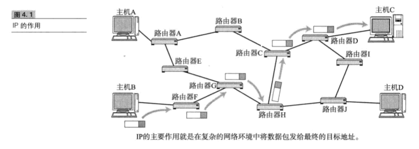

#### 4.1.2网络层与数据链路层的关系

**数据链路层提供直连两个设备之间的通信功能。与之相比，作为网络层的IP则负责在没有直连的两个网络之间进行通信传输** 

### 4.2 IP基础知识
*IP大致分为三大作用模块：它们是 IP寻址、路由（最终节点为止的转发）以及IP分包与组包。* 

#### 4.2.1 IP地址属于网络层地址

**在计算机通信中，为了识别通信对端，必须要有一个类似于地址的识别码进行标志，在数据链路层中使用MAC地址。** 
**在网络层的IP，也有这种地址信息。一般叫做IP地址。IP地址用于在“连接到网络中的所有主机识别进行通信的目标地址”。因此，在TCP/IP通信中所有主机或路由器必须设定自己的IP地址**

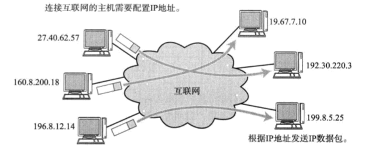

*无论一台主机与那种数据链路连接，其IP地址的形式都保持不变，以太网、无线局域网、PPP等，都不会改变IP地址的形式。* 
*网络层对数据链路层的某些特性进行了抽象。数据链路层的类型对IP地址形式透明，这本身就是其抽象化的一点。* 

#### 4.2.3 路由控制
**路由控制（Routing)是指将分组数据发送到最终目标地址的功能。即使网络非常复杂，也可以通过路由控制确定到达目标地址的通路。一旦这个路由控制的运行出现异常，分组数据既有可能迷失，无法到达目标地址。因此，一个数据包之所以能成功的到达最终的目标地址，全靠路由控制。** 

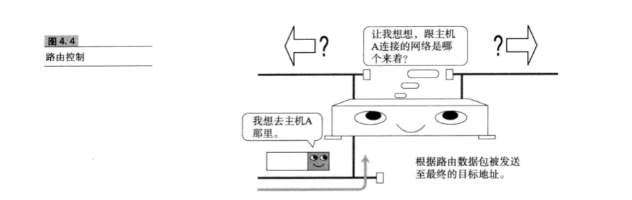

**发送数据到最终目标地址** 
	
	HOP意味中文叫 跳。它是指网络中的一个区间。IP包正是网络中一个个跳间被转发。
	
	因此IP路由也叫多跳路由。在每一个区间内决定着包在下一条被转发的路径。

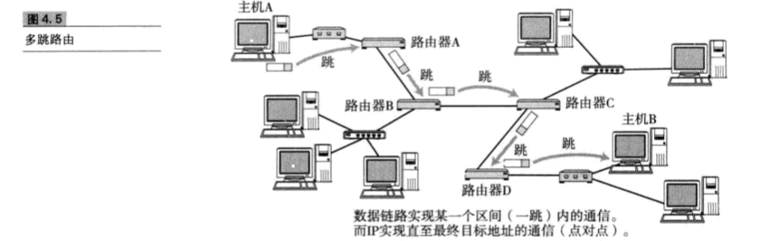

**多跳路由是指路由器或主机在转发IP数据包时只指定下一个路由器或主机，而不是将最终目标地址为止的所有通路全部指定出来。因为每一个区间（跳）在转发IP数据包时会分别指定下一跳的操作，直至包到达最终的目标地址** 

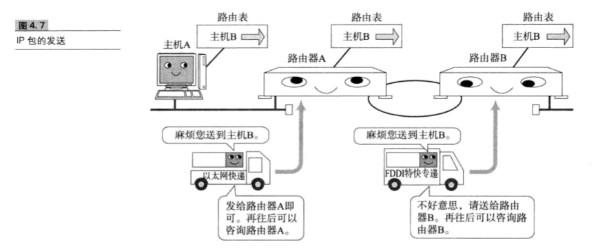

**路由控制表** 
	
	为了将数据包发给目标主机，所有主机都维护着一张路由控制表(Routing Table)。该表记录IP数据在下一步应该发送给哪个路由器。
	
	IP包将根据这个路由表在各个数据链路上传输。

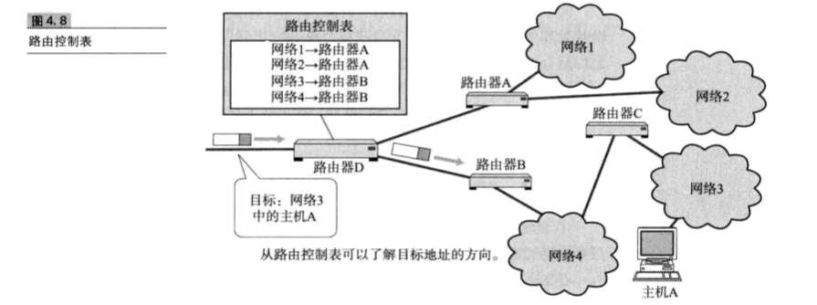	

#### 4.2.4数据链路的抽象化

**IP是实现多个数据链路之间通信的协议。数据链路根据种类的不同各有特点。对这些数据链路的相以特性进行抽象化也是IP的重要作用之一。** 
**对IP的上一层来说，无论底层数据链路使用以太网还是无线LAN抑或是PPP，都将一视同仁。** 

**不同数据链路最大区别就是，它们各自最大传输单位（MTU)不同。就好像人们在邮寄包裹或行李时有各自的大小限制。**。 

**为了解决这个问题，IP进行分片处理(IP Fragmentation),将较大的IP包分为多个较小的IP包。分片的包到了对端目标地址以后会再被组合起来传给上一层。即从IP的上层看，它完全可以忽略数据包在途中各个数据链路上的MTU。** 

#### 4.2.5 IP属于面向无连接性

		IP面向无连接，即在发包前，不需要建立与对端目标地址之间的链接。
	
		因此为了提高通信的可靠性，TCP就负责提供这种功能。
	
		如果说IP负责将数据发给目标主机，那么TCP则负责保证对端主机确实能接收到数据。

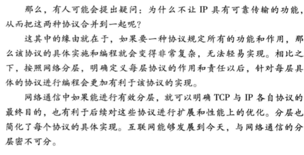

### 4.3 IP地址的基础知识

**在用TCP/IP通信时，用IP地址识别主机和路由器。为了保证正常通信，有必要为每个设备配置正确的IP地址。在互联网通信中，全世界都必须设定正确的IP地址。否则根本无法实现正常的通信。** 

#### 4.3.1IP地址的定义
	
	IP地址（IPv4地址）由32位正整数来表示。
	
	TCP/IP通信要求将这样的IP地址分配给每一个参与通信的主机。

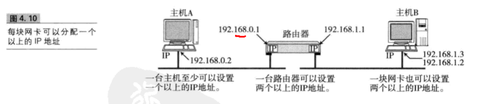

#### 4.3.2 IP地址由网络和主机两部分组成

**IP地址由“网络标致（网络地址）和主机标志（主机地址）两部份组成。”**  

**网络标致在数据链路的每个段配置不同的值。网络标志必须保证互联的每个段的地址不能重复”**  
**而相同段内相连的主机必须有相同的网络地址。IP地址的“主机标志”则不允许在同一个网段内重复出现**  

**由此，可以通过设置网络地址和主机地址，在相互连接的整个网络中保证每台主机的IP地址都不会相互重叠，即地址具有了唯一性** 

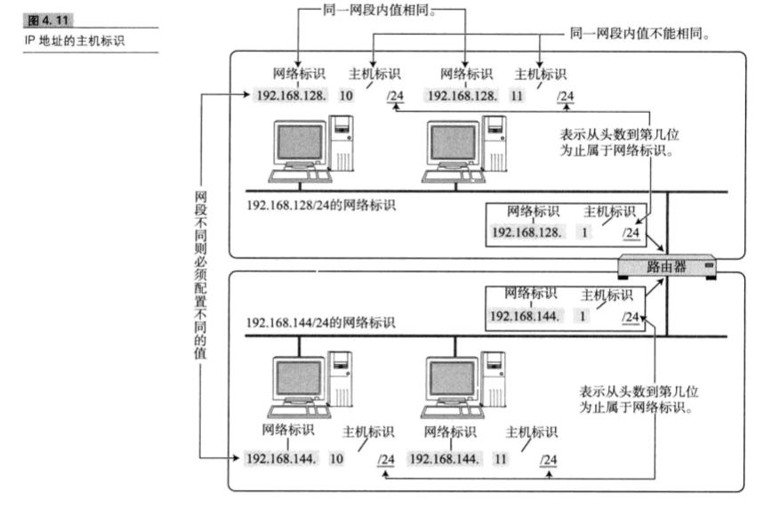

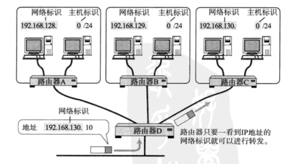
#### 4.3.3 IP地址的分类

	
	IP地址分为4个级别，分别为 A类、B类、C类、D类。它根据IP地址中从第1位到第4位的比特列对其网络标志和主机标志进行区分。
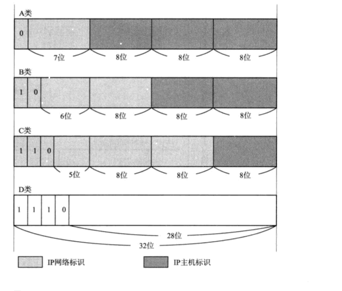

类别|描述
-|-|
A类|A类IP地址是首位以0开头的地址。从第一位到第8位是他的网络标志，用十进制表示的话，0.0.0.0~127.0.0.0是A类的网络地址。A类地址的后24位相当于主机标志，因此一个网段内可容纳的主机地址上线为 2^24-2位。
B类|B类IP地址是前两位为10的地址。从第1位到16位是他的网络标志。用十进制表示的话，128.0.0~191.255.0.0是B类地址。B类地址的后16位相当于主机标志。因此一个网段内可容纳的主机地址上限为2^16-2.
C类|C类地址是前三位为110的地址。从第1位到24位是他的网络标志。用十进制表示的话，192.0.0~223.255.255.0是C类地址。C类地址的后8为相当于主机编号。因此一个网段内可容纳的主机地址上限为2^8-2
D类|D类IP是前4位为1110的地址。从第1位到第32位是他的网络标志。用十进制表示的话，224.0.0~239.255.255.255是D类地址。D类地址没有主机标志，常被用于多播。

**在分配IP地址时关于主机标志有一点需要注意。即要用比特位表示主机地址时，不可以全部为0或全部为1.因为全部为0表示网络地址或IP地址不可货值情况下，全部为1的主机地址通常作为广播地址。** 

******************************

#### 4.3.4广播地址

	广播地址用于在同一个链路中相互连接的主机之间发送数据包。
	
	将IP地址中的主机地址全部设置为1，就成了广播地址。

	 *例如把 172.20.0.0/16用二进制表示位  
		
		10101100.00010100.00000000.00000000   （二进制）
	  将这个地址的主机部分全部改为1，则形成广播地址:
		10101100.00010100.11111111.11111111

**广播分为本地广播和直接广播两种。** 

*在本网络中的广播叫本地广播，例如网络地址为192.168.0.0/24的情况下，广播地址时192.168.0.255.因为这个广播地址的IP会被路由器屏蔽，所以不会到达192.168.0.0/24以外的其他链路上。* 

*在不同网络间的广播叫做直接广播。例如网络地址为192.168.0.0/24的主机向192.168.1.255/24的目标地址发送IP包。收到这个包的路由器，将数据转发给192.168.1.0/24,从而使得所有 192.168.1.1~192.168.1.254的主机都能收到这个包。* 

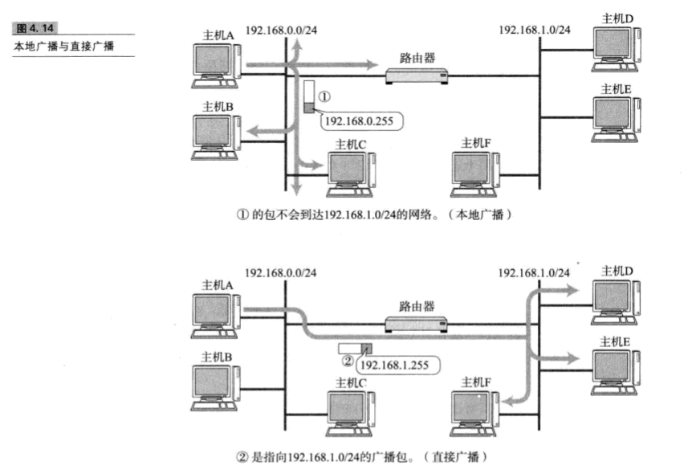

#### 4.3.5 IP多播

**多播用于将包发送给特定组内的所有主机。由于其直接使用IP协议，因此也不存在可靠传输。** 
**多播这种既可以穿透路由器，又可以实现只给那些必要的组发送数据包的技术成为必选之路。** 

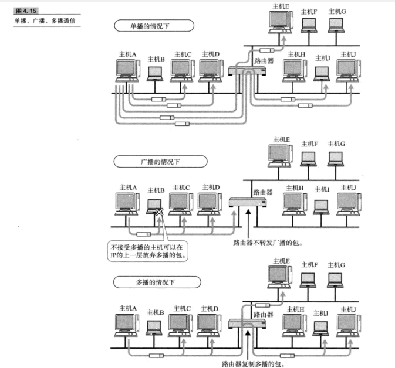

**IP多播与地址** 

	多播使用D类地址。因此，如果从首部开始到第4位是“1110”,就可以认为是多播地址。而剩下的28位就可以成为多播的组编号。

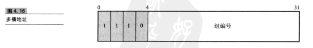
	
	从224.0.0到239.255.255.255都是多播地址的可用范围。
	
	其中，从224.0.0.0到224.0.0.255的范围不需要路由控制，在同一个链路内也能实现多播。

	而这个范围之外设置多播地址会给全网所有组呢你成员发送多播的包。

#### 4.3.6 子网掩码

	现在，一个IP地址的网络标志和主机标志已不再受限于该地址的额类别，而是由一个叫做“子网掩码”的识别码通过子网网络地址细分出比A类、B类、C类更小丽都的网络。

**自从引入子网以后，一个IP地址就有了两种识别码。一种是IP地址本身，另一个是网络部的子网掩码。子网掩码用二进制表示的话，也是一个32位的数字。它对应IP地址网络标志部分的位全部为1，对应的IP地址主机标志的部分则全为0.由此，一个IP地址可以不再受限于自己的类别，而是可以用这样的子网掩码自由的定位自己的网络标志长度。** 
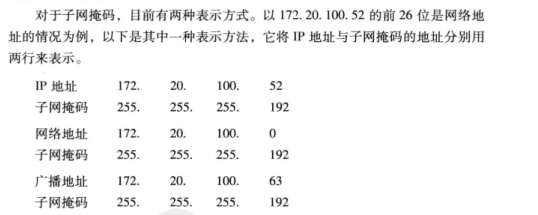

#### 4.3.7 CIDR与VLSM
	
	根据CIDR,连续多个C类地址就可以划分到一个较大的网络内。CIDR更有效的利用了当前IPV4地址，同时通过路由集中降低了路由器的负担。

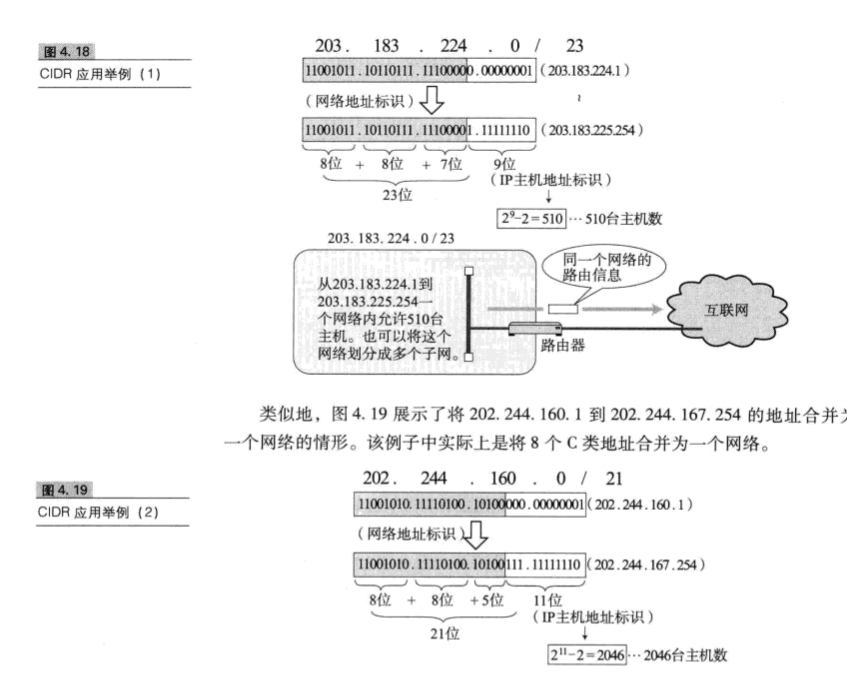

#### 4.3.8全局地址和私有地址

	
	私有地址:它不要求为每一台主机或路由器分配一个固定的IP地址，而是在必要的时候只为相应数量的设备分配唯一的IP地址。
	
	尤其对于那些没有连接互联网的独立网络中的主机，只要保证在这个网络内的地址唯一，可以不用考虑互联网即可配置IP得地址。

	不过，即使让每个独立的网络各自随意的设置IP地址，也可能会有问题。于是又出现了私有网络的IP地址: 

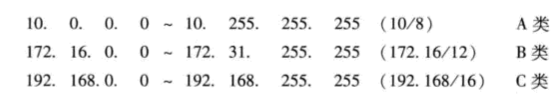

	私有IP最早没有计划连接互联网，而只用于互联网以外的独立网络。
	
	然而，当一种能够互换私有IP与全局IP的NAT技术诞生以后，配有私有地址的主机与配有全局地址的互联网主机实现了通信。

**现在许多学校、家庭、公司内部正采用在每个终端设置私有IP，而在路由器（宽带路由器)或在必要的服务器上设置全局IP地址的方法。而如果配有私有IP的地址主机联网时，则通过NAT进行通信。** 

**全局IP地址基本要在整个互联网范围内保持唯一，但私有地址不需要，只要在同一个域里保证唯一即可。在不同的域里出现相同的私有IP不会影响使用。** 
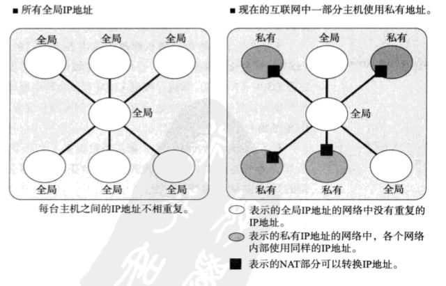

	
	现在普遍采用的一种方式是，在LAN中设置私有地址，通过少数设置全局IP地址的代理服务器结合NAT的设置进行互联网通信。

	这时IP地址个数就不限于LAN中主机个数而是由代理服务器和NAT的个数决定。

### 4.4 路由控制

	发送数据包时所使用的地址是网络层的地址，即IP地址。

	然而仅仅有IP地址还不足以实现数据包发送到对端目标地址，在数据发送过程中还需要类似“指明路由器或主机”的信息，以便真正发往目标地址。

	保存这种信息的就是路由控制表。

	实现IP通信的主机和路由器都必须持有一张这样的表。
	
	它们也正是在这个表格的基础上才得以进行数据包的发送、

**路由控制表的形成方式有两种：（1）管理员手动设置 (2)路由器和其他路由器相互交换信息时自动刷新** 

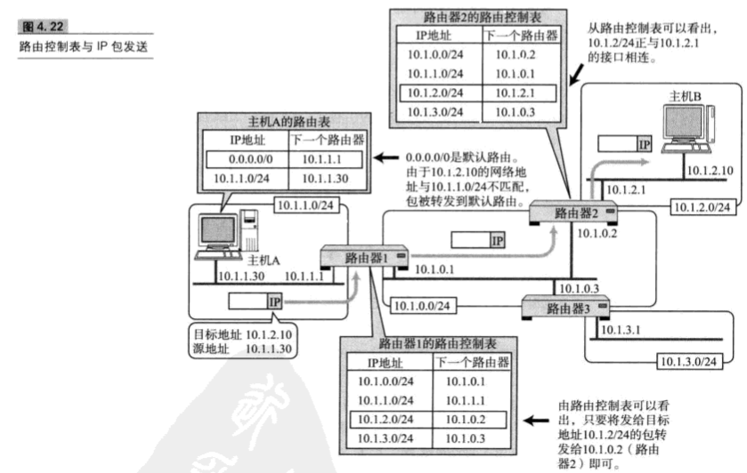

**路由控制表中记录着网络地址与下一步应该发送至路由器的地址** 

**在发送IP包时，首先要确定IP包首部中的目标地址，再从路由控制表中找到与改地址具有相同网络地址的记录，根据该记录将IP包转发给相应的下一个路由器。** 

**默认路由** 

	 如果一张路由表中包含所有的网络及其子网的信息，将会造成无端的浪费。这时，默认路由（Default Route)是不错的选择。
	
	 默认路由是指路由表中任何一个地址都能与之匹配的记录。

**环回地址** 
**环回地址是在同一台计算机上的程序之间进行网络通信时所使用的一个默认地址。计算机使用一个特殊的IP地址127.0.0.1作为环回地址。与该地址具有相同意义的是一个叫做localhost的主机名。使用这个IP或主机名时，数据包不会流向网络。** 

#### 4.4.2 路由控制表的聚合
利用网络地址的比特分布可以有效的进行分层配置。对内即使有多个子网掩码，对外呈现出的也是同一个网络地址。这样可以更好的构建网络，通过路由信息的聚合可以有效的减少路由表的条目。 

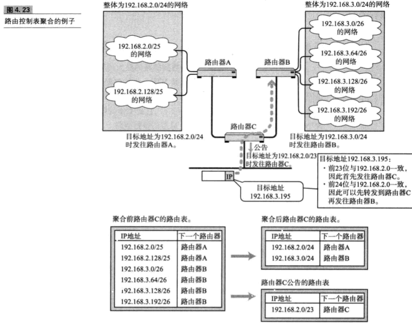

### 4.5 IP分割处理与再构成处理

#### 4.5.1、数据链路不同，MTU则相异

**每种数据链路的最大传输单元（MTU)不尽相同，鉴于IP是数据链路上一层，它必须不受限于不同数据链路的MTU大小。** 

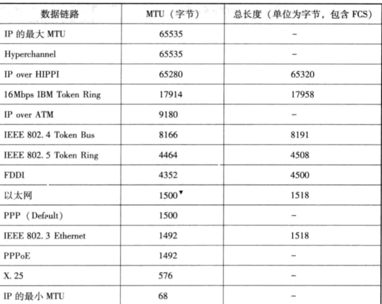

#### 4.5.2 IP报文的分组与重组
	
	任何一台主机都有必要对IP分片（IP Fragmentation）进行相应的处理。

	分片往往在网络上遇到比较大的报文无法一下子发送出去时才进行处理。

	经过分片之后的IP数据报在被重组的时候，只能由目标主机进行。路由器虽然做分组但不会进行重组。

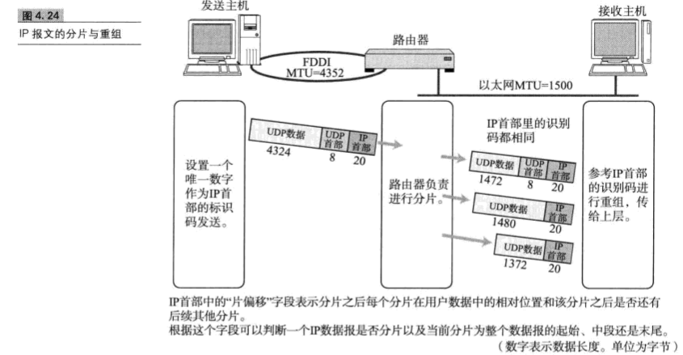

#### 4.5.3、路径MTU发现
	
	所谓路径MTU是指从发送端主机到接收端主机之间不需要分片时最大MTU的大小。

	即路径中存在的所有数据链路中最小的MTU.

	进行路径发现，就可以避免在中途的路由器上进行分片处理。

### 4.6、IPV6

#### 4.6.1、IPV6的重要性
	
	IPv6(IP Version 6)是为了根本解决IPV4地址耗尽的问题而被标准化的网际协议。
	
	IPV4的地址长度为4个8位字节，即32比特。
	
	而IPV6的地址长度则是原来的4倍，即128比特，一般写成8个16位字节。

#### 4.6.2、IPv6的特点

* IP地址的扩大与路由控制表的聚合
* IP地址依然适应于网络分层构造。分配与其地址结构相适应的IP地址，尽可能避免路由膨胀
* 性能提升
* 支持即插即用功能：即使没有DHCP服务器也可以实现自动分配IP地址
* 采用认证与加密功能
* 多播、MOBILEIP称为拓展功能

#### 4.6. IPv6中IP地址的标记方法
由于用16个数字序列表示显得有些麻烦，因此将IPv6和IPv4在标记方法上进行区分。一般人们将128以每16比特为一组，每组用冒号(":")隔开进行标记。如果出现连续的0时还可以将这些0省略，并用两个冒号("::")隔开

#### 4.6.4 IPV6地址的结构
IPV6类似IPV4，也是通过IP地址的前几位标识IP地址的种类。 

### 4.7IPv4首部

**通过IP进行通信时，需要在数据的前面加入IP首部信息。IP首部中包含着IP协议进行发包控制时所有必要信息。** 

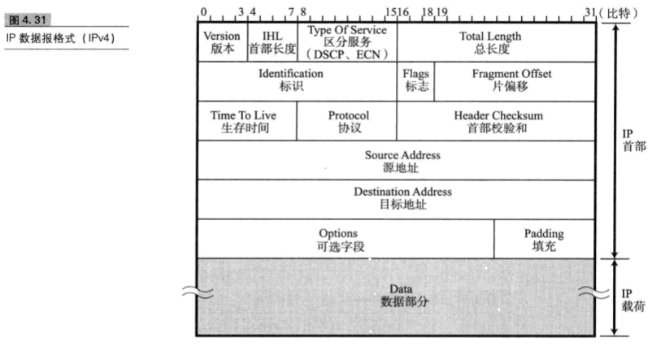

* 版本：由4比特组成，表示标志IP首部的版本号
* 首部长度：由4比特组成，表名IP首部的大小
* 区分服务：由8比特组成，用来表明服务质量
* 总长度：表示IP首部和数据部分合起来的总字节数，该字段长16比特。
* 标志：用于分片重组，同一个分片的标志值相同，不同分片的标志值不同。通常，每发送一个IP包，它的值也会逐渐递增。
* 标志：表示包被分片的相关信息
* 片偏移：用来标志被分片的每一个分段相对于原始数据的位置，第一个分片对应的值为0
* 生存时间：它最初的意思是以秒为单位记录当前包在网络上应该生存的期限。然而在实际中它指可以中转多少个路由器的意思，每经过一个路由器,TTL会减少1，直到变成0则丢弃包。
* 协议：表示IP包传输层的上层协议
* 首部校验和：该字段只校验数据报的首部，不校验数据部分
* 原地址：表示发送端的IP地址
* 目标地址：表示接受端的IP地址
* 数据：将IP协议的首部也作为数据处理

### 4.8IPV6首部格式
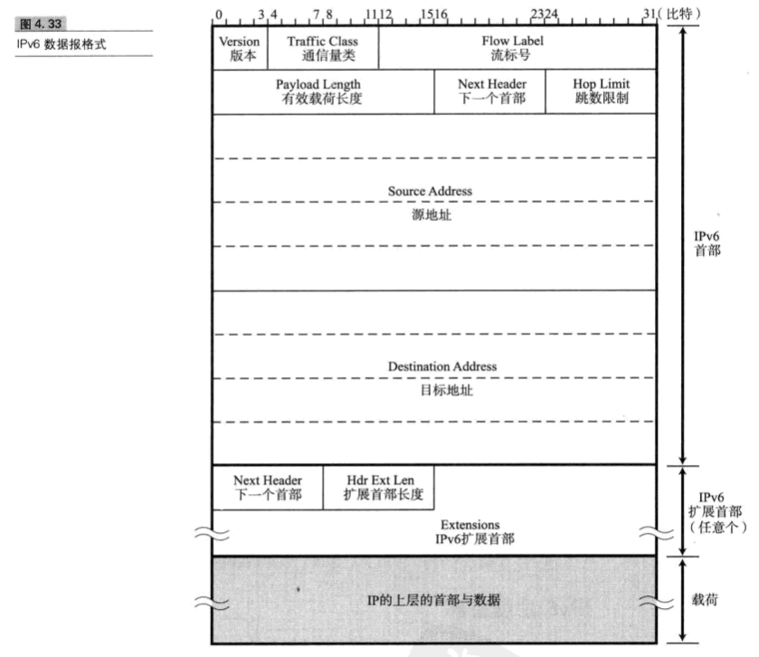

* 版本：由4比特组成，表示标志IP首部的版本号
* 下一个首部：通常表示IP的上一层协议是TCP或UDP
* 跳数限制：强调可通过路由器的个数
* 原地址：由128比特构成，表示发送端的IP地址
* 目标地址：由128比特构成，表示接收端的IP地址

