##6TCP和UDP

### 6.1传输层的作用

	TCP/IP中两个具有代表性的传输协议，它们分别是TCP和UDP.
	
	TCP提供可靠的通信传输，而UDP则常被用于让广播和细节控制交给应用的通信传输。
	
	
#### 6.1.1传输层的定义
	
在TCP/IP的通信中，需要指定姓氏，即“应用程序"。而传输层必须指出这个具体的程序，为了是爱按这一功能，使用`端口号`这样一种识别码。根据端口号就可以识别在传输层上一层的应用层中所要进行处理的具体程序。

#### 6.1.2通信处理
TCP/IP的众多应用协议大多以客户端/服务端的形式运行。客户端类似于客户的意思，是请求的发起端。而服务端则表示提供服务的意思，是请求的处理端。另外，作为服务端的程序有必要提前启动，准备接受客户端的请求。否则即使有客户端的请求发送过来，也无法做到相应的处理。 

确认请求究竟是发给那个服务端，可以通过所收到的数据包的目标端口轻松识别，当收到TCP的建立连接请求时，如果目标端口号为22则转给SSHD,如果是80则转给httpd。  

**传输协议TCP、UDP通过接受数据中的目标端口号可以识别目标处理程序。**  

#### 6.1.3两种传输协议UDP和TCP

* TCP

TCP是面向连接的、可靠的流协议。流就是指不间断的数据结构。当应用程序采用TCP发送消息时，虽然可以保证发送的顺序，但还是犹如没有间隔的数据流发送给接收端。 

**TCP为提供可靠性传输，实行”顺序控制“或”重发控制“机制。此外还具有”流控制（流量控制）、拥塞控制、提高网络利用率等众多功能。“**  

* UDP  
	**UDP是不具有可靠性的数据报协议。细微的处理它会交给上层的应用去完成，在UDP的情况下，虽然可以确保发送消息的大小，去不能保证消息一定会会到达。** 

### 6.2端口号
#### 6.2.1端口号定义
数据链路和IP中的地址，分别指的是MAC地址和IP地址。前者用来识别同一链路中的不同计算机，后者用来识别TCP/IP中互联的主机和路由器。在传输层中也有这种类似于地址的概念，那就是端口号。端口号用来识别计算机中进行通信的不同应用程序。

#### 6.2.2根据端口号识别应用

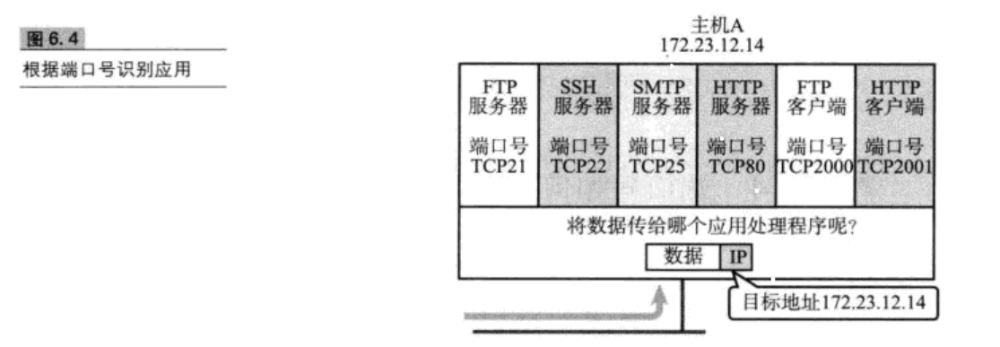

#### 6.2.3端口号如何确定
(1)标准既定的端口号 
**这种方法也叫静态方法，它是指每个应用程序都有其指定的端口号。但并不是说可以随意使用任何一个端口号，每个端口号都有其对应的使用目的。**  
	
		例如，HTTP、TELENET、FTP等被广为使用的应用协议中所使用的端口号就是固定的。这些端口号也被称为知名端口号。
（2）时序分配法
	
**此时，服务端有必要坚挺端口，但是接受服务的客户端没有必要确定端口号。在这种方法下，客户端应用程序可以完全不用自己设置端口号，而全权交给操作系统分配。操作系统可以为每个应用程序分配互不冲突的端口号。**  

#### 6.2.4端口号与协议
**端口号由其使用的传输层协议决定。因此，不同的传输协议可以使用相同的端口号。例如，TCP和UDP使用同一个端口号，但使用目的各不相同。这是因为端口号上的处理是根据每个传输协议的不同而进行的。**  

**数据到达IP层后，会先检查IP首部中的协议号，再传给相应协议的模块。如果是TCP则传递给TCP模块，如果是UDP则传递给UDP模块去做端口号的处理** 

### 6.3、UDP
#### UDP的特点及其目的
* UDP不提供复杂的控制机制，利用IP提供面向无连接的通信服务。并且它是将应用程序发来的数据在收到的那一刻，立即按照原样发送到网络上的一种机制。  
* 即使出现网络拥堵的情况下，UDP也无法进行流量控制等避免网络拥塞的行为  
* 传输途中即使出现丢包，UDP也不负责重发。甚至当出现包的到达顺序乱掉时也没有纠正的能力。如果需要这些细节控制，那么不得不交由采用UDP的应用程序去处理。  
* UDP有点类似于用户说什么就听设么的机制，但是需要用户充分考虑上层协议类型并制作相应的硬硬程序，

### 6.4TCP
	
		UDP是一种没有复杂控制，提供面向无连接通信服务的一种协议。换句话说，它将部分控制转移给应用程序去处理，自己却只提供作为传输层协议的最基本功能。

**于UDP不同，TCP是对”传输、发送、通信“进行控制的协议**  

**TCP于UDP的区别相当大。它充分地实现了数据传输时各种控制功能，可以进行丢包时的重发控制，还可以对次序乱掉的分包进行顺序控制。而这些在UDP中都没有。此外，TCP作为一种面向有链接的协议，只有在确认通信对端存在时才会发送数据，从而可以控制通信流量的浪费。**  

#### 6.4.1TCP的特点及其目的
**为了通过IP数据报实现可靠性传输，需要考虑很多事情，例如数据的破坏、丢包、重复以及分片顺序混乱等问题。** 

**TCP通过`检验和`、`序列号`、`确认应答`、`重发控制`、`连接管理`以及`窗口控制`等机制实现可靠性传输。**

#### 6.4.2、通过序列号于确认应答提高可靠性
**在TCP中，当发送端的数据到达接收主机时，接受端主机会返回一个已收到消息的通知。这个消息叫做确认应答。** 
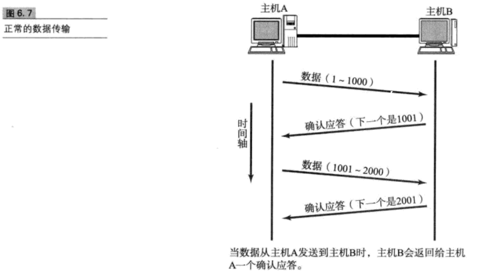

**TCP通过肯定的确认应答（ACK)实现可靠的数据传输。当发送端将数据发出之后会等待对端的确认应答。如果有确认应答，说明数据已经成功到达对端，反之，则数据丢失的可能性很大。**  
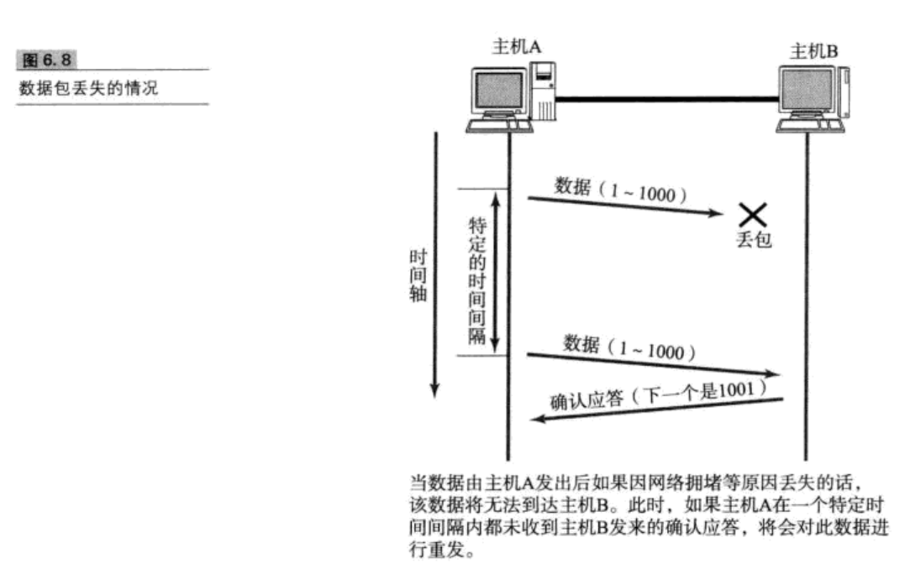

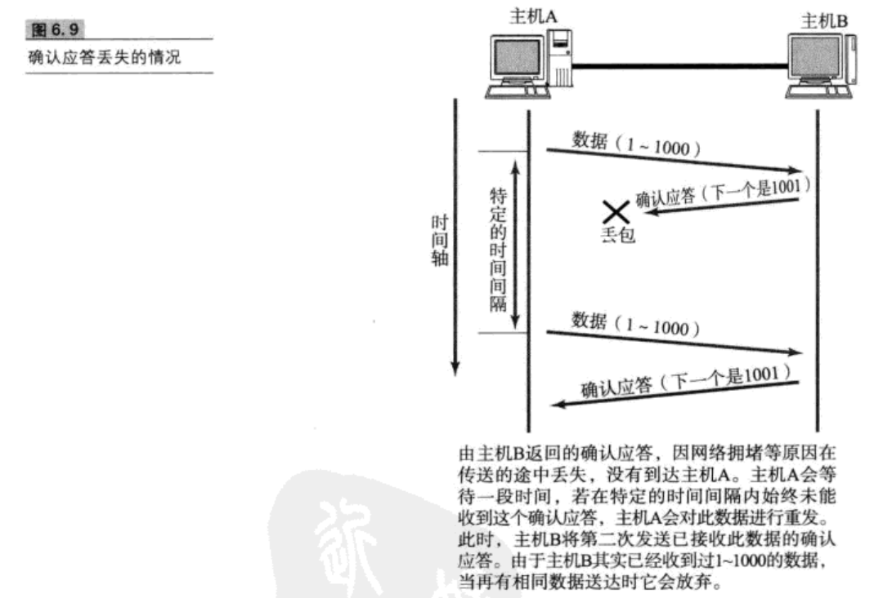
此外，也有可能因为其他一些原因导致确认应答延迟到达，在源主机重发数据以后才到达的情况下也屡见不鲜。此时，源发送主机只要按照机制重发数据即可，但是对于目标主机来说，这简直时一种”灾难“。它会反复收到相同的数据。而为了对上层应用提供可靠的传输，必须得放弃重复的数据包。为此，就必须引入一种机制，它能够识别是否已经接受数据，又能够判断是否需要接受。  

**上述这些确认应答处理、重发控制以及重复控制等功能都可以通过 序列号实现。**  

**序列号是按顺序给发送数据的每一个字节都标上号码的编号，接受端查询接收端查询接收数据TCP首部中的序列号和数据的长度，将自己下一步应该接受的序号作为确认应答返送回去。就这样，通过序列号和确认应答号，TCP可以实现可靠传输。**  

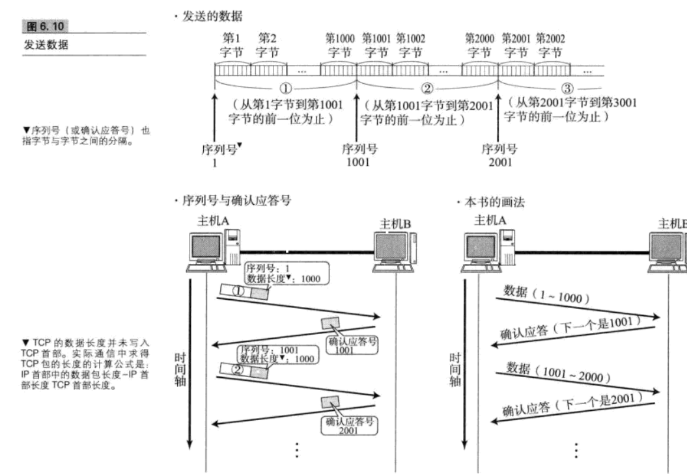

#### 6.4.3、重发超时如何确定
重发超时是指在重发数据之前，等待确认应答到来的那个特定时间间隔。如果超过了这个时间仍未收到确认应答，发送端将进行数据重发。

#### 6.4.4、连接管理（三次握手，四次挥手）
TCP提供面向有连接的通信传输。面向有连接是指在数据通信开始之前先做好通信两端的准备工作。 

**UDP是一种面向无连接的通信协议，因此不检查对端是否可以通信，直接将UDP包发送出去。TCP与此相反，它会在数据通信之前，通过TCP首部发送一个SYN包作为建立连接的请求等待确认应答，如果对端发来确认应答，则认为可以进行通信。**

**三次握手，四次挥手** 
**为什么三次握手，四次挥手** 
**三次握手，四次挥手是什么** 

**三次握手：客户端和服务端通信要进行连接三次握手的作用是双方都能明确自己和对方的收发能力都是正常的饿**  

**四次挥手：TCP连接是双向传输的等效模式**  

**三次握手** 

* 客户端发送SYN包（SYN=1)并进入SYN_SED状态，等待服务器确认。  
* 服务器收到SYN包，必须确认客户SYN包，同时自己也发送一个SYN包。  
* 客户端收到服务器的SYN+ACK发送确认包ACK.  

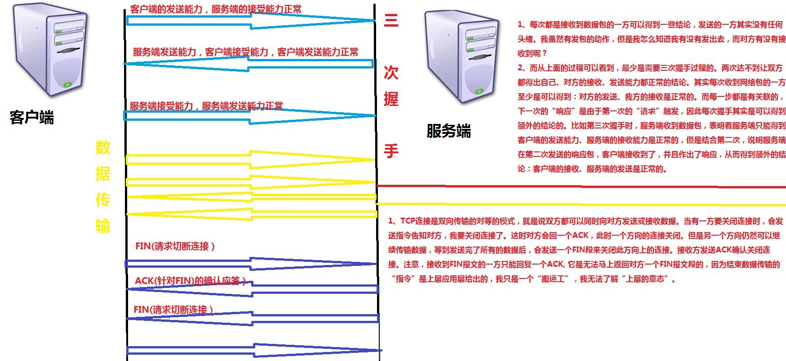

#### 6.4.5TCP以段为单位发送数据
在建立TCP连接的同时，也可以确认发送数据包的单位，我们也可称其为”最大消息长度（MSS)“.最理想的情况是，最大消息长度正好是IP中不会被分片处理的最大数据长度。  

**MSS是在三次握手的时候，在两端主机之间被计算得出。两端的主机在发出建立连接的请求时，会在TCP首部写入MSS选项，告诉对方自己的借口能够适应MSS的大小。会在两者之间选择一个较小的值投入使用**  

#### 6.4.6、利用窗口提高速度

TCP以一个段为单位，每发送一个段进行确认应答的处理，这样的传输方式有一个缺点，那就是，包的往返时间越长通信性能就越低。  

为解决这个问题，TCP引入了窗口这个概念。即使往返时间较长的情况下，它也能控制网络性能下降的问题。确认应答不再是以每个分段，而是以更大的单位进行确认，转发时间将会被大幅度缩短。也就是说，发送端主机，在发送一个段以后不必要一直等待确认应答，而是继续发送给。

**在滑动窗口以外的部分包括尚未发送的数据以及已经确认对端已收到的数据。当数据发送后若如期收到确认应答就可以不用再进行重发，此时数据就可以从缓存区清除**  

**收到确认应答的情况下，将窗口滑动到确认应答中的序列号的位置。这样可以顺序地将多个段同时发送提高通信性能。这种机制也被称为滑动窗口控制**  

#### 6.4.7窗口控制与重发控制
在使用窗口控制中，如果出现段丢失该怎么办？

* 当确认应答未能返回的情况下，数据已经到达对端，是不需要再进行重发的。
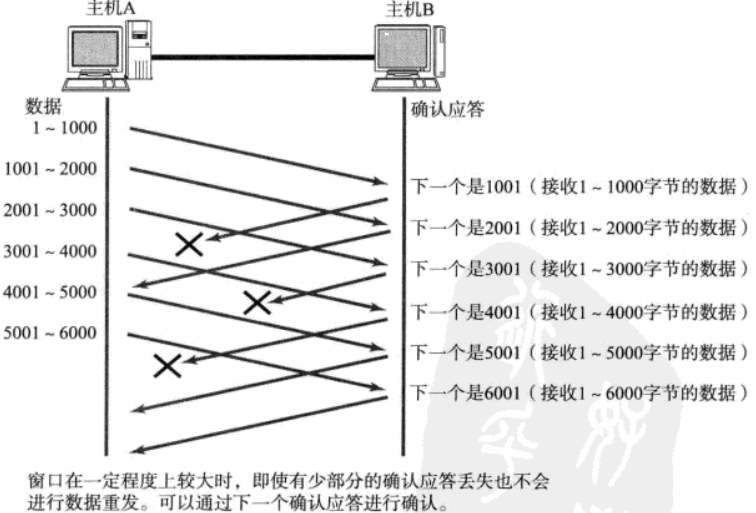

* 某个报文段丢失，接收端如果收到一个自己应该接受到的序号以外的数据时，会针对目前为止收到的数据返回确认应答。  
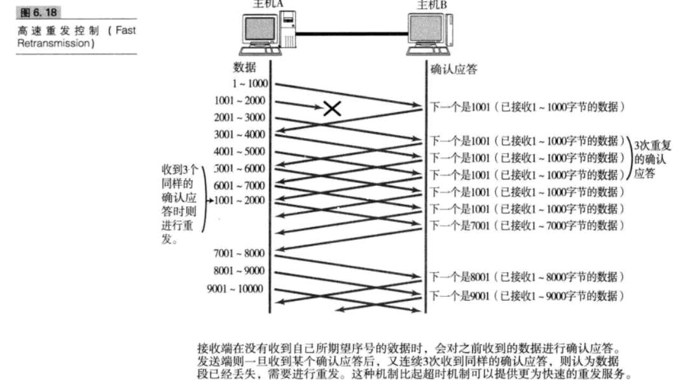

#### 6.4.8、流控制

TCP提供一种机制可以让发送端根据接收端的实际接收能里控制发送 的数据量。这就是所谓的流控制。它的具体操作是，接收端主机向发送端主机通知自己可以接受数据的大小，于是发送端会发送不超过这个限度的数据。该大小限度就被称作窗口的大小。  

**TCP首部中，专门有一个字段用来通知窗口大小。接受主机将自己可以接收的缓冲区的大小放入这个字段中通知给发送端。这个字段的值越大，说明网络的吞吐量越高**  

**接收端的缓冲区一旦面临输几局溢出时，窗口大小的值也会随之被设置为一个更小的值通知给发送端从而控制发送两。也就是说。发送端主机会根据接收端主机的指示，对发送数据的量进行控制。这也就形成了一个完整的TCP流控制。（流量控制）**

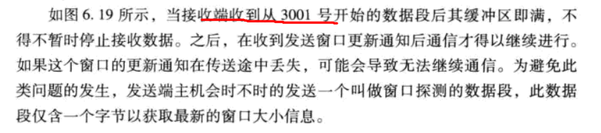

#### 6.4.9、拥塞控制
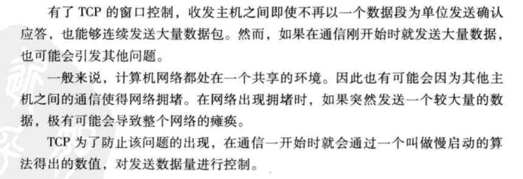
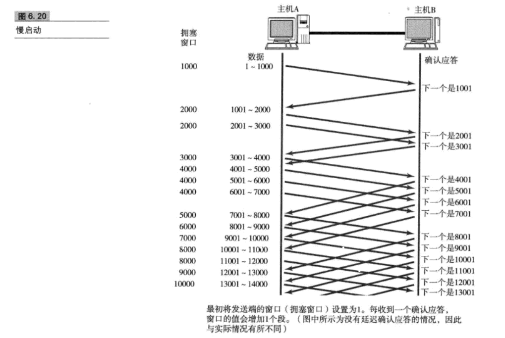

#### 6.4.10提高网络利用率的规范

#####   Nagle算法
该算法是指发送端即使还有应该发送的数据，但如果这部分数据很少的话，则进行延迟发送的一种处理机制。

##### 延迟确认应答
接收数据的主机如果每次都立刻回复确认应答的话，可能会返回一个娇小的窗口。 

当某个接受端收到这个小窗口通知以后，会以它的上限 

**事实上，大可不必为每一个数据段都进行一次确认应答，TCP采用滑动窗口的控制机制，因此通常确认应答少一些也无妨。  **

**tcp文件传输中，绝大多数是没两个数据段返回一次确认应答。**  
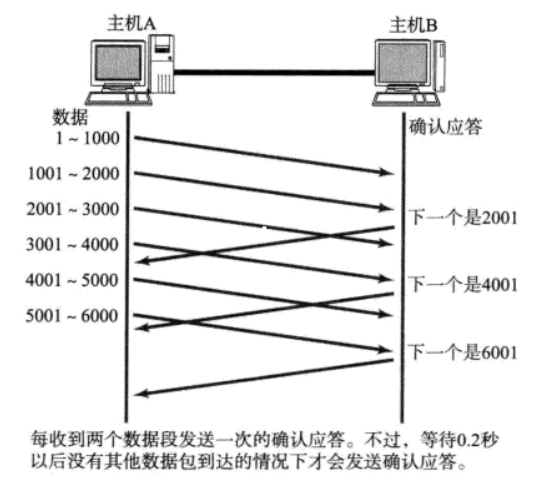

### 6.5UDP首部的格式

**用户数据报UDP有两个字段：数据字段和首部字段。首部字段很简单，只有8个字节，由四个字段组成，每个字段的长度都是两个字节。**  
* 源端口号
 
	* 表示发送端端口号，字段为16位。该字段是可选项，有时可能不会设置源端口号，没有源端口号的时候该字段的值为0.
	
  

*  目标端口号
	
	* 表示接受端端口号

  

* 包长度
	* 该字段保存了UDP首部的长度跟数据的长度和。

  '

* 校验和

	* 检测UDP用户数据报在传输中是否有错。有错就丢弃。
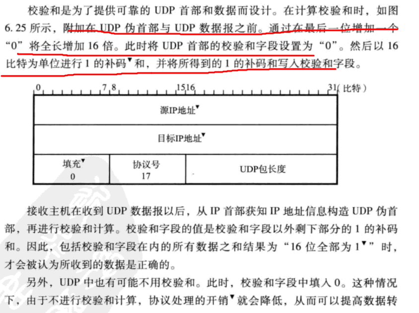
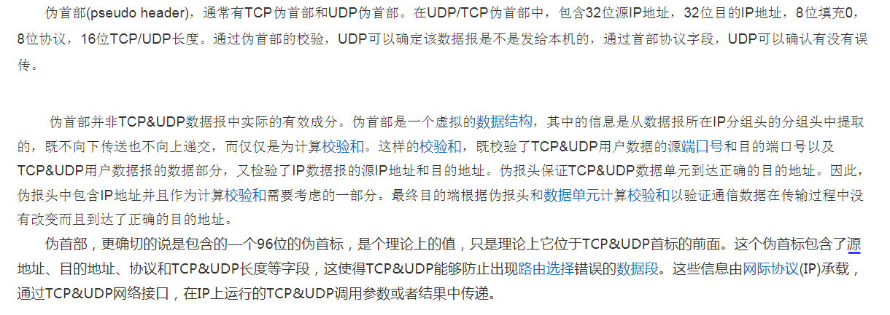

### 6.6、TCP首部格式
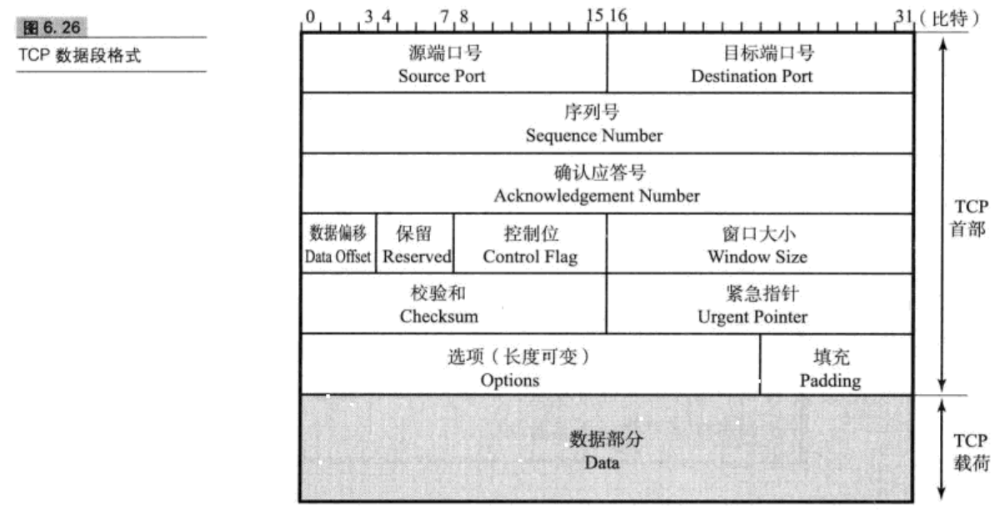

* 源端口号：表示发送端端口号，字段长为16位
* 目标端口号：表示接受端端口号，字段长为16位
* 序列号：字段长为32位，序列号是指发送数据的位置，没发送一次数据，就累加一次该数据字节数的大小。
* 确认应答号：确认应答号字段长度为32位。是指下一次应该受到的数据的序列号。实际上，它是指已经收到确认应答号减一为止的数据。**发送端收到这个确认应答以后可以认为在这个序列号以前的数据都已经被正常接受**
* 数据偏移：该字段表示TCP所传输的数据部分应该从TCP包的哪位开始计算。
* 保留：该字段主要是为了以后扩展时使用，其长度为4位。一般设置为0，但即使受到的包在该字段不为0，此包也不会被丢弃。
* 控制位：字段长为8位，每一位聪明能干左☞右分别为CWR、ECE、URG、ACK、PSH、RST、SYN、FIN。这些控制标志也叫做控制位。
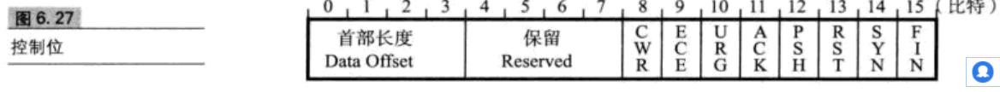
	* CWR标志与后面的ECE标志都用于IP首部的ECN字段。ECE标志为1时，则通知对方已将拥塞窗口缩小。
	* ECE标志表示ECN-Echo。设置为1会通知通信对方，从对方到这边的网络有拥塞。
	* URG:该位为1时，表示包中有需要紧急处理的数据。对于需要紧急处理的数据，会在后面的紧急指针中再进行解释
	* ACK:该位为1时，确认应答的字段变为有效。TCP规定了除了最初建立连接时的SYN包之外该位必须设置为1.
	* PSH:该位为1时，表示需要将受到的数据立刻传给上从的应用协议.PSH为0时，则不需要立即传而是先进行缓存。
	* RST:该位为1时，表示TCP连接中出现异常必须强制断开连接。
	* SYN:该位为1时，表示希望建立连接，并在其序列号的字段进行序列号初始值的设定。
	* FIN:该位为1时，表示今后不会再有数据的发送，希望断开连接。当通信结束希望断开连接时，通信双方的主机之间就可以相互交换FIN位置为1的TCP段。每个主机又对对方的FIN包进行确认应答以后就可以断开连接。不过，主机收到FIN设置为1的TCP段以后不必马上回复FIN包，而是可以等到缓冲区中的所有数据都已经成功发送而被自动删除之后再发送。 

* 窗口大小
	* 该字段长度为16位，用于通知从相同TCP首部的确认应答号所指定位置开始能够接受的数据大小。TCP不允许发送超过此处所示大小的数据。不过，如果窗口为0，则表示可以发送窗口探测，以了解最新的窗口大小。

* 校验和
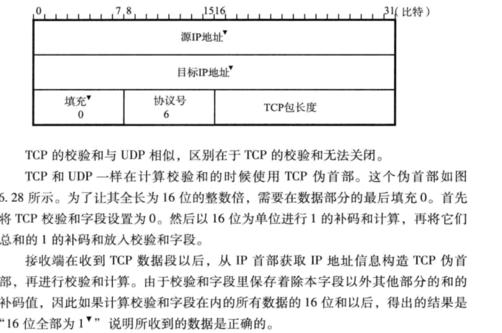

* 紧急指针 
该字段的长度为16位。只有在URG控制位为1时有效。该字段的数值表示本报文段中紧急数据的指针。正确来讲，从数据部分的首位到紧急指针所指示的位置位置为紧急数据。因此也可以说紧急指针指出了紧急数据的末尾在报文段中的位置。  

* 选项

